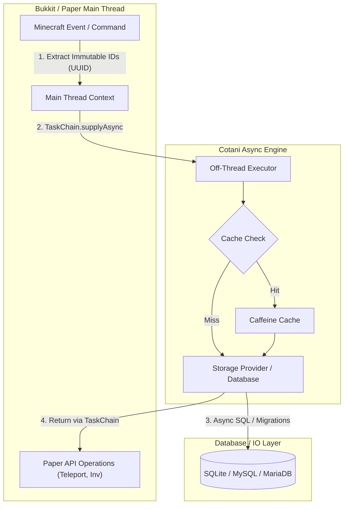

<div align="center">

# ⚡ Cotani

**A high-performance, modular, async-safe architecture framework for modern Paper/PaperSpigot plugin development.**

[](https://github.com/HanielCota/Cotani/actions)
[](LICENSE)
[](https://adoptium.net)
[](https://papermc.io)
[](https://jitpack.io/#HanielCota/Cotani)

---

[Overview](#-overview) • [Architecture](#-architecture) • [Modules Matrix](#-modules-matrix) • [Code Showcase](#-code-showcase) • [Installation](#-installation) • [Standards](#-architectural-standards)

</div>

---

## 📌 Overview

**Cotani** is an enterprise-grade architectural foundation designed specifically for high-load Minecraft server plugins built on Paper, PaperSpigot, and Folia. It strictly enforces non-blocking async execution patterns, isolates heavy IO operations from region/main threads, and provides type-safe abstractions for common plugin components.

### 🌟 Key Pillars

- **🔒 Main-Thread Safety**: Guarantees zero lag spikes by delegating database queries, configuration parsing, and file IO off the main thread.
- **⚡ Non-Blocking Pipeline**: Utilizes pure non-blocking reactive pipelines via `CompletionStage` and custom `TaskChain` transitions—no `.join()`, `.get()`, or `Thread.sleep()`.
- **📦 12 Decoupled Modules**: Micro-modular design allowing developers to include only what they need (Economy, Teleport, Storage, Cache, Config, etc.).
- **🛠️ Zero Static Mutability**: Built on pure constructor injection, dependency control, and explicit lifecycle management.
- **💎 Type-Safe Java 21+ Records**: Map YAML/JSON configuration files directly into immutable Java `record` instances with strict validation annotations.

---

## 📐 Architecture

Cotani implements a strict boundary between asynchronous IO execution and Paper's main/region server threads:



---

## 🧩 Modules Matrix

Cotani is split into 12 standalone, decoupled modules. Each module contains dedicated documentation and focused contracts:

| Module | Description | Documentation |
| :--- | :--- | :--- |
| 🚀 **`cotani-core`** | Bootstrap container, ordered service shutdown, lifecycle management. | [Core Docs](file:///D:/Cotani/cotani-core/README.md) |
| ⚡ **`cotani-task`** | Thread switching (`TaskChain`), retries, timeouts, and scheduler wrappers. | [Task Docs](file:///D:/Cotani/cotani-task/README.md) |
| 💾 **`cotani-cache`** | Caffeine-backed caching with automated dirty tracking & background saves. | [Cache Docs](file:///D:/Cotani/cotani-cache/README.md) |
| 📝 **`cotani-config`** | Immutable configuration mapping from YAML directly into Java `record`s. | [Config Docs](file:///D:/Cotani/cotani-config/README.md) |
| 🗄️ **`cotani-storage`** | Off-thread SQL driver engine (SQLite/MySQL/MariaDB) with automated migrations. | [Storage Docs](file:///D:/Cotani/cotani-storage/README.md) |
| 🎨 **`cotani-text`** | MiniMessage formatting, dynamic placeholder pipelines & audience delivery. | [Text Docs](file:///D:/Cotani/cotani-text/README.md) |
| ⚔️ **`cotani-item`** | Fluent `ItemStack` & skull builders with MiniMessage lore/name support. | [Item Docs](file:///D:/Cotani/cotani-item/README.md) |
| 👤 **`cotani-user`** | Async session resolution, player data loading, and cache flushes. | [User Docs](file:///D:/Cotani/cotani-user/README.md) |
| 💰 **`cotani-economy`** | Idempotent transactions with exact `BigDecimal` precision. | [Economy Docs](file:///D:/Cotani/cotani-economy/README.md) |
| 🌀 **`cotani-teleport`** | Async teleport sequences with safety checks, countdowns & combat checks. | [Teleport Docs](file:///D:/Cotani/cotani-teleport/README.md) |
| ⏳ **`cotani-cooldown`** | Persistent database and in-memory rate limiting and action cooldowns. | [Cooldown Docs](file:///D:/Cotani/cotani-cooldown/README.md) |
| 📢 **`cotani-event`** | Reflection-free, prioritized event publishing bus with subscription controls. | [Event Docs](file:///D:/Cotani/cotani-event/README.md) |

---

## 💻 Code Showcase

<details>
<summary><b>1. Plugin Bootstrap & Lifecycle Management</b></summary>

```java
public final class CorePlugin extends JavaPlugin {

    private Cotani cotani;
    private PaperTaskScheduler scheduler;

    @Override
    public void onEnable() {
        this.scheduler = SchedulerFactory.create(this);

        this.cotani = Cotani.forPlugin(this)
            .with(scheduler)
            .build();
    }

    @Override
    public void onDisable() {
        if (cotani != null) {
            cotani.close(); // Gracefully flushes caches, closes storage pools & cancels tasks
        }
    }
}
```
</details>

<details>
<summary><b>2. Safe Thread Transitions with TaskChain</b></summary>

```java
// Run database query off-thread -> switch safely back to Paper main thread
scheduler.supplyAsync(() -> userRepository.loadUser(playerUniqueId))
    .thenGlobal(userOpt -> {
        // Safe to call Paper/Bukkit APIs here
        userOpt.ifPresent(user -> player.sendMessage(Component.text("Welcome back, " + user.name())));
        return userOpt;
    })
    .thenAsync(userOpt -> auditLogService.recordLogin(playerUniqueId))
    .toCompletionStage();
```
</details>

<details>
<summary><b>3. Immutable Record-Backed Configuration</b></summary>

```java
@ConfigPath("database.yml")
public record DatabaseConfig(
    @Default("localhost") String host,
    @Range(min = 1024, max = 65535) int port,
    @Required String database,
    @Default("root") String username,
    @Default("") String password
) {}

// Load or reload asynchronously without blocking
configService.loadAsync(DatabaseConfig.class)
    .thenAccept(config -> logger.info("Database host: " + config.host()));
```
</details>

<details>
<summary><b>4. Idempotent Economy Operations</b></summary>

```java
EconomyOperationId operationId = EconomyOperationId.random();
EconomyReason reason = EconomyReason.player("shop_purchase");

economyService.withdraw(player.getUniqueId(), BigDecimal.valueOf(150.00), reason, operationId)
    .whenComplete((transaction, error) -> {
        if (error instanceof InsufficientFundsException) {
            player.sendMessage(Component.text("You cannot afford this item!", NamedTextColor.RED));
        } else if (transaction != null) {
            player.sendMessage(Component.text("Purchased item! New balance: $" + transaction.newBalance()));
        }
    });
```
</details>

<details>
<summary><b>5. Fluent MiniMessage Item Builder</b></summary>

```java
ItemStack item = ItemBuilder.of(Material.NETHERITE_SWORD)
    .customName("<gradient:#ff416c:#ff4b2b><bold>Lava Blade</bold></gradient>")
    .lore(
        "<gray>Forged in nether flames.",
        "<yellow>Damage: <white>+15"
    )
    .enchant(Enchantment.SHARPNESS, 5)
    .glow()
    .build();

player.getInventory().addItem(item);
```
</details>

---

## 📥 Installation

Cotani is published via **JitPack**. Add the repository and desired modules to your build file:

### Gradle (Kotlin DSL)

```kotlin
repositories {
    mavenCentral()
    maven("https://jitpack.io")
}

dependencies {
    val cotaniVersion = "1.0.0"

    implementation("com.github.HanielCota.Cotani:cotani-core:$cotaniVersion")
    implementation("com.github.HanielCota.Cotani:cotani-task:$cotaniVersion")
    implementation("com.github.HanielCota.Cotani:cotani-cache:$cotaniVersion")
    implementation("com.github.HanielCota.Cotani:cotani-storage:$cotaniVersion")
    implementation("com.github.HanielCota.Cotani:cotani-text:$cotaniVersion")
    implementation("com.github.HanielCota.Cotani:cotani-item:$cotaniVersion")
}
```

<details>
<summary><b>Gradle (Groovy DSL) & Maven</b></summary>

#### Gradle (Groovy)

```groovy
repositories {
    mavenCentral()
    maven { url 'https://jitpack.io' }
}

dependencies {
    implementation 'com.github.HanielCota.Cotani:cotani-core:1.0.0'
    implementation 'com.github.HanielCota.Cotani:cotani-task:1.0.0'
}
```

#### Maven (`pom.xml`)

```xml
<repositories>
    <repository>
        <id>jitpack.io</id>
        <url>https://jitpack.io</url>
    </repository>
</repositories>

<dependency>
    <groupId>com.github.HanielCota.Cotani</groupId>
    <artifactId>cotani-core</artifactId>
    <version>1.0.0</version>
</dependency>
```
</details>

---

## 🛡️ Architectural Standards

> [!IMPORTANT]
> **Non-Blocking Rule**: Never call `future.join()`, `future.get()`, or `Thread.sleep(...)` inside application code.

> [!WARNING]
> **Entity Isolation**: Never store live `Player`, `World`, or `Entity` references inside long-lived services or capture them inside async lambdas. Always extract immutable identifiers (`UUID`, `Location` copies) first.

> [!TIP]
> **Defensive API Design**: All Cotani public APIs return unmodifiable collections (`List.copyOf`, `Set.copyOf`) and use Java `Optional` instead of returning `null`.

For detailed architecture guides and developer cookbooks, check out:
- 📖 [Repository Rules (`AGENTS.md`)](file:///D:/Cotani/AGENTS.md)
- 🍳 [Cotani Developer Cookbook](file:///D:/Cotani/docs/ai/cotani-cookbook.md)
- 📐 [Java Engineering Standards](file:///D:/Cotani/.agents/skills/java-engineering-standards/SKILL.md)
- ⚡ [Java Async Standards](file:///D:/Cotani/.agents/skills/java-async-standards/SKILL.md)
- 🏗️ [Paper Plugin Architecture](file:///D:/Cotani/.agents/skills/paper-plugin-architecture/SKILL.md)

---

## 🤝 Contributing & Security

Contributions are welcome! Please review our [Contributing Guide](file:///D:/Cotani/CONTRIBUTING.md) before submitting Pull Requests.

- 🐛 **Found a bug?** Open a [Bug Report](https://github.com/HanielCota/Cotani/issues/new?template=bug_report.yml).
- ✨ **Have an idea?** Submit a [Feature Request](https://github.com/HanielCota/Cotani/issues/new?template=feature_request.yml).
- 🔒 **Security Vulnerability?** Read our [Security Policy](file:///D:/Cotani/SECURITY.md).

---

## 📄 License

This project is licensed under the **MIT License**. See the [LICENSE](file:///D:/Cotani/LICENSE) file for details.

<div align="center">
<sub>Crafted with ❤️ for high-performance PaperSpigot server networks.</sub>
</div>
