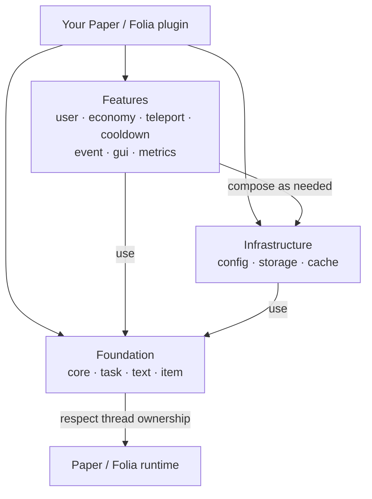

<div align="center">

# Cotani

**Composable infrastructure for safe, non-blocking Paper and Folia plugins.**

Build with only the scheduling, storage, cache, configuration and gameplay modules your plugin needs.

[](https://github.com/HanielCota/Cotani/actions/workflows/ci.yml)
[](https://adoptium.net/)
[](https://papermc.io/)
[](https://jitpack.io/#HanielCota/Cotani)
[](LICENSE)

[English](README.md) · [Português](README.pt-BR.md)

[Overview](#overview) · [Compatibility](#compatibility) · [Installation](#installation) · [Choose modules](#choose-your-modules) · [Architecture](#architecture) · [Quick start](#five-minute-quick-start) · [Troubleshooting](#troubleshooting)

</div>

## Overview

Cotani is a Java 25 multi-module library for building Paper and Folia plugins with explicit execution boundaries. It provides focused APIs for scheduling, persistence, caching, configuration and common gameplay systems without turning the plugin main class into a service locator.

| Concern | Cotani approach |
| --- | --- |
| Thread ownership | Global, region and entity transitions through `PaperTaskScheduler` and `TaskChain` |
| Asynchronous work | Composable `CompletionStage` APIs and explicit executors—no hidden blocking |
| Persistence | SQLite, MySQL and MariaDB providers with migrations and transactions |
| State | Caffeine-backed caches with loading, persistence and invalidation contracts |
| Plugin lifecycle | Centralized ownership and non-blocking shutdown of registered resources |
| API quality | Immutable values, null-safe contracts and isolated implementation packages |

## Compatibility

| Cotani | Java | Paper API | Availability | Modules |
| --- | --- | --- | --- | --- |
| `1.0.0` | 25 | 26.2 | Stable tag on JitPack | Core, task, text, item, config, storage, cache, user, economy, cooldown, teleport and event |
| `1.1.0-SNAPSHOT` | 25 | 26.2 | Source or commit build only | All stable modules plus BOM, GUI and metrics |

> [!NOTE]
> `1.0.0` is the latest tagged release. Do not use the literal version `1.1.0` until that tag is published. Documentation on `master` describes the current snapshot; browse the [`1.0.0` tag](https://github.com/HanielCota/Cotani/tree/1.0.0) for the exact stable API.

## Installation

### Stable release

Add Paper and JitPack to your repositories, then declare only the top-level modules you use:

```kotlin
repositories {
    mavenCentral()
    maven("https://repo.papermc.io/repository/maven-public/")
    maven("https://jitpack.io")
}

dependencies {
    val cotaniVersion = "1.0.0"

    implementation("com.github.HanielCota.Cotani:cotani-task:$cotaniVersion")
    implementation("com.github.HanielCota.Cotani:cotani-storage:$cotaniVersion")
}
```

Gradle resolves each module's Cotani dependencies transitively. You do not need to declare `cotani-core` when a selected module already depends on it.

### Current snapshot and BOM

The BOM exists in the current source tree but has not been released. To test it without referring to a nonexistent version, publish the checkout locally:

```bash
./gradlew publishToMavenLocal
```

Then consume the local snapshot:

```kotlin
repositories {
    mavenLocal()
    mavenCentral()
    maven("https://repo.papermc.io/repository/maven-public/")
}

dependencies {
    implementation(platform("com.cotani:cotani-bom:1.1.0-SNAPSHOT"))
    implementation("com.cotani:cotani-task")
    implementation("com.cotani:cotani-storage")
}
```

> [!IMPORTANT]
> Cotani modules are libraries, not standalone server plugins. Shade and relocate them into your plugin unless your deployment deliberately provides them separately.

## Choose your modules

Declare the module that matches the capability you need; its internal Cotani dependencies come with it.

| I need to… | Declare | Availability |
| --- | --- | --- |
| Own resource lifecycle only | `cotani-core` | `1.0.0` |
| Schedule async, global, region or entity work | `cotani-task` | `1.0.0` |
| Format Adventure and MiniMessage text | `cotani-text` | `1.0.0` |
| Build Paper items fluently | `cotani-item` | `1.0.0` |
| Bind and reload YAML as immutable records | `cotani-config` | `1.0.0` |
| Use SQLite, MySQL or MariaDB with migrations | `cotani-storage` | `1.0.0` |
| Cache generic or player-bound data | `cotani-cache` | `1.0.0` |
| Resolve users and manage sessions | `cotani-user` | `1.0.0` |
| Run idempotent economy operations | `cotani-economy` | `1.0.0` |
| Acquire local or distributed cooldowns | `cotani-cooldown` | `1.0.0` |
| Execute protected teleport pipelines | `cotani-teleport` | `1.0.0` |
| Dispatch reflection-free domain events | `cotani-event` | `1.0.0` |
| Build reactive inventory interfaces | `cotani-gui` | `1.1.0-SNAPSHOT` |
| Export Micrometer and Prometheus metrics | `cotani-metrics` | `1.1.0-SNAPSHOT` |
| Align every module version | `cotani-bom` | `1.1.0-SNAPSHOT` |

Every stable module has its own usage guide in the [module reference](#module-reference).

## Architecture

Cotani is organized in layers. Feature modules compose infrastructure and foundation modules instead of reaching through global state.


```mermaid
flowchart TB
    Plugin["Your Paper / Folia plugin"]
    Features["Features<br/>user · economy · teleport · cooldown<br/>event · gui · metrics"]
    Infrastructure["Infrastructure<br/>config · storage · cache"]
    Foundation["Foundation<br/>core · task · text · item"]
    Runtime["Paper / Folia runtime"]

    Plugin --> Features
    Plugin --> Infrastructure
    Plugin --> Foundation
    Features -->|compose as needed| Infrastructure
    Features -->|use| Foundation
    Infrastructure -->|use| Foundation
    Foundation -->|respect thread ownership| Runtime
```

The [complete architecture reference](docs/architecture.md) contains the real Gradle dependency graph and the runtime sequence from asynchronous I/O back to the global, region or entity thread.

## Five-minute quick start

This example creates a shaded plugin with a `/cotanihello` command. The command captures a player's UUID, delegates to a service and returns through Cotani's entity scheduler before accessing Paper.

### 1. Configure Gradle

`settings.gradle.kts`:

```kotlin
rootProject.name = "cotani-quick-start"
```

`build.gradle.kts`:

```kotlin
plugins {
    java
    id("com.gradleup.shadow") version "9.6.1"
}

group = "com.example"
version = "0.1.0"

java {
    toolchain.languageVersion.set(JavaLanguageVersion.of(25))
}

repositories {
    mavenCentral()
    maven("https://repo.papermc.io/repository/maven-public/")
    maven("https://jitpack.io")
}

dependencies {
    compileOnly("io.papermc.paper:paper-api:26.2.build.85-stable")
    implementation("com.github.HanielCota.Cotani:cotani-task:e2f91df")
}

tasks.shadowJar {
    archiveClassifier.set("")
    mergeServiceFiles()
    relocate("com.cotani", "com.example.cotaniquickstart.libs.cotani")
}

tasks.build {
    dependsOn(tasks.shadowJar)
}
```

This quick start pins a current source commit because the non-blocking `closeAsync()` lifecycle shown below was added after `1.0.0`. Replace the commit with `1.1.0` when that release is tagged.

If you add `cotani-metrics`, also relocate `net.cotani` to your plugin's private namespace.

### 2. Describe the plugin

Create `src/main/resources/plugin.yml`:

```yaml
name: CotaniQuickStart
version: '0.1.0'
main: com.example.cotaniquickstart.CotaniQuickStartPlugin
description: Minimal Cotani example
api-version: '26.2'
commands:
  cotanihello:
    description: Confirms that Cotani is running
    usage: /cotanihello
```

### 3. Add the plugin class

Copy the [compile-checked `CotaniQuickStartPlugin`](docs-examples/src/main/java/com/example/cotaniquickstart/CotaniQuickStartPlugin.java). It demonstrates a thin lifecycle class, constructor injection, a thin command and a named entity task without storing a live `Player` in asynchronous state.

### 4. Build and run

```bash
./gradlew shadowJar
```

Copy the JAR from `build/libs` into the server's `plugins` directory, start Paper and run `/cotanihello` as a player.

### Async to entity-thread pattern

When an asynchronous service result needs to touch a player, retain the UUID and return through `TaskChain`:

```java
UUID playerId = player.getUniqueId();
CompletionStage<String> messageStage = messageService.loadAsync(playerId);

var _ = scheduler.chain(messageStage)
    .consumeEntity(playerId, message -> {
        var onlinePlayer = Bukkit.getPlayer(playerId);
        if (onlinePlayer != null) {
            onlinePlayer.sendMessage(Component.text(message));
        }
    })
    .toCompletionStage()
    .whenComplete((_, failure) -> {
        if (failure != null) {
            logger.log(Level.SEVERE, "Could not message player " + playerId, failure);
        }
    });
```

> [!WARNING]
> Never call `join()`, `get()` or `Thread.sleep(...)` in application code. Never capture live `Player`, `World`, `Entity`, `Inventory` or `Block` objects into asynchronous flows.

## Troubleshooting

| Symptom | Likely cause | Fix |
| --- | --- | --- |
| JitPack cannot resolve `1.1.0` | The version is still a snapshot | Use stable `1.0.0`, a commit-based build or publish the snapshot locally |
| A first commit-based JitPack build times out | JitPack is building the commit on demand | Retry once after the remote build finishes or use `publishToMavenLocal` |
| `NoClassDefFoundError: com/cotani/...` | The unshaded JAR was deployed | Build and deploy the output of `shadowJar` |
| An async-catcher or wrong-thread error appears | Bukkit/Paper was accessed from async code | Carry UUIDs and return through `global`, `region` or `entity` scheduling |
| The server stalls during a command or event | A future or I/O operation blocked the owner thread | Compose with `CompletionStage`; remove `join()`, `get()` and synchronous I/O |
| GUI opens but clicks are ignored | `CotaniGuiModule` was not registered | Follow the [`cotani-gui` bootstrap guide](cotani-gui/README.md) |
| Database integration tests do not start | Docker is unavailable | Start Docker, verify `docker info`, then rerun `./gradlew integrationTest` |

## Module reference

| Module | Purpose |
| --- | --- |
| [`cotani-core`](cotani-core/README.md) | Lifecycle ownership and coalesced resource shutdown |
| [`cotani-task`](cotani-task/README.md) | Async, global, region and entity scheduling with `TaskChain` |
| [`cotani-storage`](cotani-storage/README.md) | SQLite, MySQL and MariaDB access, migrations and transactions |
| [`cotani-cache`](cotani-cache/README.md) | Caffeine-backed data and player caches with persistence |
| [`cotani-config`](cotani-config/README.md) | YAML binding to immutable records, validation and async reload |
| [`cotani-user`](cotani-user/README.md) | Async user resolution and session lifecycle |
| [`cotani-economy`](cotani-economy/README.md) | Precise, idempotent and auditable economy operations |
| [`cotani-teleport`](cotani-teleport/README.md) | Policy-driven teleport pipelines and safety checks |
| [`cotani-cooldown`](cotani-cooldown/README.md) | Local and distributed cooldown acquisition |
| [`cotani-event`](cotani-event/README.md) | Reflection-free event dispatch and subscriptions |
| [`cotani-gui`](cotani-gui/README.md) | Declarative inventory UIs with reactive state and exploit guards |
| [`cotani-metrics`](cotani-metrics/README.md) | Micrometer metrics and optional Prometheus export |
| [`cotani-text`](cotani-text/README.md) | Adventure and MiniMessage formatting helpers |
| [`cotani-item`](cotani-item/README.md) | Fluent Paper data-component item builders |

## Documentation

- [Cotani cookbook](docs/ai/cotani-cookbook.md) — end-to-end plugin recipes
- [Complete architecture](docs/architecture.md) — real module dependencies and execution boundaries
- [Asynchronous API contracts](docs/async-contracts.md) — execution and failure semantics
- [Cotani 1.x migration notes](docs/migration-1.x.md) — compatibility guidance
- [Compile-checked examples](docs-examples/src/main/java/com/cotani/examples/CotaniExamples.java) — examples validated by the build
- [Showcase plugin examples](docs-examples/src/main/java/com/cotani/examples/showcase/ShowcasePlugin.java) — complete reference plugin implementation

## Development

Clone the repository and run the checks with the included wrapper:

```bash
git clone https://github.com/HanielCota/Cotani.git
cd Cotani
./gradlew spotlessApply
./gradlew check
```

`check` runs unit tests, formatting validation, Error Prone, NullAway, compile-checked documentation examples and module-boundary checks. Docker-backed database suites are separate:

```bash
./gradlew integrationTest
```

See the [contributor workflow](CONTRIBUTING.md), [security policy](SECURITY.md) and [engineering rules](AGENTS.md) before submitting changes.
