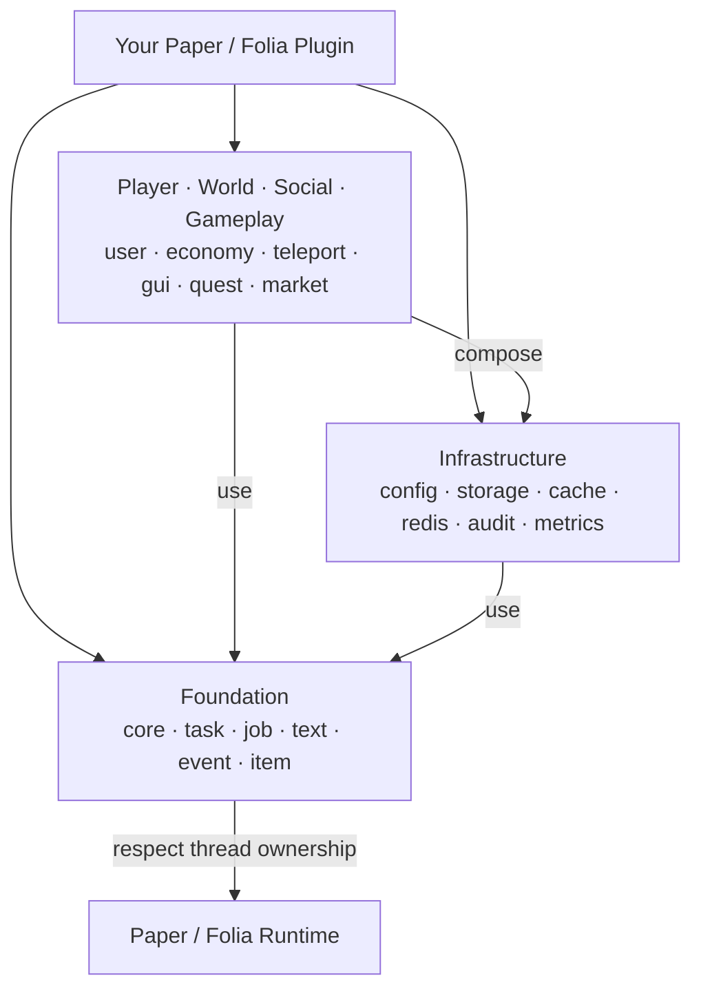

<div align="center">


# Cotani

**Composable, high-performance infrastructure for safe, non-blocking Paper and Folia plugins.**

Build scalable Minecraft plugins with explicit execution boundaries, zero-reflection events, reactive GUIs, and robust persistence.

[](https://github.com/HanielCota/Cotani/actions/workflows/ci.yml)
[](https://adoptium.net/)
[](https://papermc.io/)
[](https://hanielcota.github.io/Cotani/api/)
[](https://jitpack.io/#HanielCota/Cotani)
[](LICENSE)

[English](README.md) · [Português](README.pt-BR.md)

[Overview](#overview) · [Compatibility](#compatibility) · [Installation](#installation) · [Modules](#choose-your-modules) · [Architecture](#architecture) · [Quick start](#five-minute-quick-start) · [Troubleshooting](#troubleshooting) · [Documentation](#documentation--resources)

---

</div>

## Overview

Cotani is a modern Java 25 multi-module framework designed for Paper and Folia plugin development. It replaces fragile global state and main-thread blocking with explicit thread transitions, composable `CompletionStage` APIs, and clean domain isolation.

| Concern | Cotani Approach |
| :--- | :--- |
| **🧵 Thread Ownership** | Global, region, and entity transitions managed through `PaperTaskScheduler` and `TaskChain` |
| **⚡ Asynchronous Work** | Composable `CompletionStage` APIs with explicit executors — no hidden blocking or `join()` |
| **💾 Persistence** | SQLite, MySQL, and MariaDB drivers with automated schema migrations and transaction runners |
| **🧠 State & Caching** | Caffeine-backed caches with automatic dirty tracking, bulk flushing, and invalidation contracts |
| **🔄 Plugin Lifecycle** | Centralized ownership, reverse-order disposal, and non-blocking shutdown of registered resources |
| **🛡️ API Quality** | Immutable records, strict null-safety, and isolated implementation packages |

---

## Compatibility

| Cotani Version | Java Version | Paper API | Release Status | Included Modules |
| :--- | :---: | :---: | :--- | :--- |
| `1.1.2` | 25 | 26.2 | Stable tag on JitPack | All published modules |
| `1.0.0` | 25 | 26.2 | Legacy tag on JitPack | Core, task, text, item, config, storage, cache, user, economy, cooldown, teleport, event |

---

## Installation

### Stable Release (`1.1.2`)

Add PaperMC and JitPack to your build script repositories, then declare only the top-level modules your plugin needs:

```kotlin
repositories {
    mavenCentral()
    maven("https://repo.papermc.io/repository/maven-public/")
    maven("https://jitpack.io")
}

dependencies {
    val cotaniVersion = "v1.1.2"

    implementation("com.github.HanielCota.Cotani:cotani-task:$cotaniVersion")
    implementation("com.github.HanielCota.Cotani:cotani-storage:$cotaniVersion")
}
```

Gradle automatically resolves internal Cotani dependencies transitively (e.g. `cotani-core` is pulled in when `cotani-task` is declared).

### BOM Alignment

To align versions across all Cotani modules, consume the published Bill of Materials (BOM):

```kotlin
repositories {
    mavenCentral()
    maven("https://repo.papermc.io/repository/maven-public/")
    maven("https://jitpack.io")
}

dependencies {
    val cotaniVersion = "v1.1.2"
    implementation(platform("com.github.HanielCota.Cotani:cotani-bom:$cotaniVersion"))
    implementation("com.github.HanielCota.Cotani:cotani-task")
    implementation("com.github.HanielCota.Cotani:cotani-storage")
    implementation("com.github.HanielCota.Cotani:cotani-gui")
}
```

When consuming a local checkout instead, run `./gradlew publishToMavenLocal`, add `mavenLocal()`, and use the
`com.cotani` coordinates documented in [`cotani-bom/README.md`](cotani-bom/README.md).

### GitHub Packages (Authenticated Alternative)

Every tagged release is also published to GitHub Packages with sources, Javadocs, Gradle module metadata, and Maven
POMs. GitHub requires a classic personal access token with `read:packages`, including for public Maven packages:

```kotlin
repositories {
    maven {
        url = uri("https://maven.pkg.github.com/HanielCota/Cotani")
        credentials {
            username = System.getenv("GITHUB_PACKAGES_USER")
            password = System.getenv("GITHUB_PACKAGES_TOKEN")
        }
    }
}

dependencies {
    val cotaniVersion = "1.1.2"
    implementation(platform("com.cotani:cotani-bom:$cotaniVersion"))
    implementation("com.cotani:cotani-task")
}
```

Keep the token outside the build script. For public, anonymous dependency resolution, use the JitPack coordinates above.

> [!IMPORTANT]
> Cotani modules are libraries, not standalone server plugins. Shade and relocate `com.cotani` into your plugin's private namespace using Gradle Shadow.

---

## Choose Your Modules

Declare only the modules required for your feature set; transitive dependencies are included automatically.

### 🧱 Foundation & Execution

| Module | Capability | Availability |
| :--- | :--- | :---: |
| [`cotani-core`](cotani-core/README.md) | Centralized plugin lifecycle and safe resource disposal | `1.1.2` |
| [`cotani-task`](cotani-task/README.md) | Async, global, region, and entity scheduling with fluent `TaskChain` | `1.1.2` |
| [`cotani-job`](cotani-job/README.md) | Persistent named jobs with retries, recurring schedules, cancellation, and crash recovery | `1.1.2` |
| [`cotani-text`](cotani-text/README.md) | MiniMessage parsing, audience messaging, and placeholder resolvers | `1.1.2` |
| [`cotani-event`](cotani-event/README.md) | Reflection-free, high-performance event bus with priority dispatching | `1.1.2` |
| [`cotani-item`](cotani-item/README.md) | Fluent Paper 1.21+ data-component item, armor, and skull builders | `1.1.2` |

### ⚙️ Infrastructure & Persistence

| Module | Capability | Availability |
| :--- | :--- | :---: |
| [`cotani-config`](cotani-config/README.md) | YAML binding to immutable records with constraint validation & async reload | `1.1.2` |
| [`cotani-storage`](cotani-storage/README.md) | SQLite, MySQL, and MariaDB queries, schema migrations, and transactions | `1.1.2` |
| [`cotani-cache`](cotani-cache/README.md) | Caffeine-backed caches with automatic dirty-tracking and persistence | `1.1.2` |
| [`cotani-redis`](cotani-redis/README.md) | Non-blocking Redis client, pub/sub messaging, distributed locks & sync | `1.1.2` |
| [`cotani-metrics`](cotani-metrics/README.md) | Micrometer metrics collector with optional Prometheus HTTP export | `1.1.2` |

### 👤 Player & Account

| Module | Capability | Availability |
| :--- | :--- | :---: |
| [`cotani-user`](cotani-user/README.md) | Async user profile loading, online cache, and session management | `1.1.2` |
| [`cotani-permission`](cotani-permission/README.md) | Async permission nodes, groups, inheritance decisions, and SQL persistence | `1.1.2` |
| [`cotani-economy`](cotani-economy/README.md) | Exact `BigDecimal` economy, atomic transactions, and idempotency guarantees | `1.1.2` |
| [`cotani-cooldown`](cotani-cooldown/README.md) | Local and distributed SQL-backed cooldown limits with automatic pruning | `1.1.2` |
| [`cotani-inventory`](cotani-inventory/README.md) | Binary inventory snapshots, rollback, and cross-server transfer locks | `1.1.2` |
| [`cotani-locale`](cotani-locale/README.md) | Player locale preferences, fallback catalogs, and safe MiniMessage rendering | `1.1.2` |

### 🌍 World, UI & Platform

| Module | Capability | Availability |
| :--- | :--- | :---: |
| [`cotani-teleport`](cotani-teleport/README.md) | Policy-driven teleport pipelines with hazard checks, combat tags & delays | `1.1.2` |
| [`cotani-location`](cotani-location/README.md) | Immutable homes and warps with asynchronous persistence and safe teleport integration | `1.1.2` |
| [`cotani-region`](cotani-region/README.md) | 3D spatial regions, chunk grid indexer, protection flags, and transition events | `1.1.2` |
| [`cotani-npc`](cotani-npc/README.md) | Virtual packet-based player NPCs with dynamic look-at, skins, equipment, and click raycasting | `1.1.2` |
| [`cotani-display`](cotani-display/README.md) | Modern Display Entity engine for text, item, and block holograms | `1.1.2` |
| [`cotani-hud`](cotani-hud/README.md) | Reactive zero-flicker scoreboards, dynamic tablist, bossbars, and actionbars | `1.1.2` |
| [`cotani-nametag`](cotani-nametag/README.md) | Scoreboard team-driven nametag formatting, tablist sorting priority, and collision rules | `1.1.2` |
| [`cotani-gui`](cotani-gui/README.md) | Reactive inventory UIs with declarative structure, pagination & anti-dupe guards | `1.1.2` |
| [`cotani-command`](cotani-command/README.md) | Declarative command framework with async arguments, cooldowns, and Folia thread safety | `1.1.2` |
| [`cotani-dialog`](cotani-dialog/README.md) | Non-blocking reactive chat, sign, and anvil input prompts and multi-step wizards | `1.1.2` |
| [`cotani-placeholder`](cotani-placeholder/README.md) | Async-safe placeholder expansion, MiniMessage integration, and PlaceholderAPI bridge | `1.1.2` |

### 🤝 Social & Multiplayer

| Module | Capability | Availability |
| :--- | :--- | :---: |
| [`cotani-party`](cotani-party/README.md) | Async parties with expiring invitations, roles, leadership transfer, and persistence SPI | `1.1.2` |
| [`cotani-friend`](cotani-friend/README.md) | Async friendships, requests, blocks, optimistic persistence, and domain events | `1.1.2` |
| [`cotani-queue`](cotani-queue/README.md) | Async priority queues, expiring tickets, capacity limits, and atomic matchmaking | `1.1.2` |
| [`cotani-trade`](cotani-trade/README.md) | Confirmation-based player trading with immutable offers and idempotent settlement | `1.1.2` |
| [`cotani-mail`](cotani-mail/README.md) | Persistent player mail with TTL, idempotent sends, inbox pagination, and SQL persistence | `1.1.2` |

### 🎮 Gameplay & Domain Systems

| Module | Capability | Availability |
| :--- | :--- | :---: |
| [`cotani-punishment`](cotani-punishment/README.md) | Immutable async bans, mutes, warnings, expiration, revocation, and audit integration | `1.1.2` |
| [`cotani-reward`](cotani-reward/README.md) | Persistent rewards with cooldowns, streaks, idempotent claims, immutable grants, and SQL persistence | `1.1.2` |
| [`cotani-reward-integration`](cotani-reward-integration/README.md) | Economy and entity-thread-safe inventory settlement adapters for rewards | `1.1.2` |
| [`cotani-quest`](cotani-quest/README.md) | Objective-based quests with optimistic progress, idempotent claims, events, and SQL persistence | `1.1.2` |
| [`cotani-statistics`](cotani-statistics/README.md) | Atomic asynchronous player statistics with bounded rankings, events, and SQL persistence | `1.1.2` |
| [`cotani-ranking`](cotani-ranking/README.md) | Named, bounded player rankings backed by `cotani-statistics` | `1.1.2` |
| [`cotani-achievement`](cotani-achievement/README.md) | Asynchronous achievements with statistic criteria, idempotent unlocks, rewards, events, and SQL progress | `1.1.2` |
| [`cotani-season`](cotani-season/README.md) | Seasonal progression with idempotent XP grants, cumulative levels, reward claims, events, and SQL persistence | `1.1.2` |
| [`cotani-market`](cotani-market/README.md) | Persistent player marketplace with bounded listings, idempotent purchases, recovery-safe settlement, and SQL persistence | `1.1.2` |

### 🧹 Operations & Tooling

| Module | Capability | Availability |
| :--- | :--- | :---: |
| [`cotani-cleanup`](cotani-cleanup/README.md) | Safe world entity cleanup with previews, explicit policies, batching, and Paper/Folia thread safety | `1.1.2` |
| [`cotani-audit`](cotani-audit/README.md) | Immutable append-only audit trail with bounded async queries | `1.1.2` |
| [`cotani-audit-storage`](cotani-audit-storage/README.md) | Indexed, idempotent SQL persistence adapter for audit events | `1.1.2` |
| [`cotani-bom`](cotani-bom/README.md) | Bill of Materials for version alignment across all Cotani modules | `1.1.2` |

The groups describe how consumers use the modules; they are not a dependency graph. For exact dependencies and
selection guidance, see the [module index](docs/module-index.md).

---

## Architecture

Cotani is organized into clean architectural layers. Feature modules compose infrastructure and foundation components instead of relying on mutable global singletons.


```mermaid
flowchart TB
    Plugin["Your Paper / Folia Plugin"]
    Features["Player · World · Social · Gameplay<br/>user · economy · teleport · gui · quest · market"]
    Infrastructure["Infrastructure<br/>config · storage · cache · redis · audit · metrics"]
    Foundation["Foundation<br/>core · task · job · text · event · item"]
    Runtime["Paper / Folia Runtime"]

    Plugin --> Features
    Plugin --> Infrastructure
    Plugin --> Foundation
    Features -->|compose| Infrastructure
    Features -->|use| Foundation
    Infrastructure -->|use| Foundation
    Foundation -->|respect thread ownership| Runtime
```

Read the [complete architecture reference](docs/architecture.md) for the full dependency graph and thread-boundary sequence diagrams.

---

## Five-Minute Quick Start

This walkthrough sets up a shaded Paper plugin whose `/cotanihello` command captures the player `UUID`, transitions to the player's entity thread, and only then touches Bukkit/Paper state.

### 1. Configure Gradle

`build.gradle.kts`:

```kotlin
plugins {
    java
    id("com.gradleup.shadow") version "9.6.1"
}

group = "com.example"
version = "0.1.0"

java {
    toolchain.languageVersion.set(JavaLanguageVersion.of(25))
}

repositories {
    mavenCentral()
    maven("https://repo.papermc.io/repository/maven-public/")
    maven("https://jitpack.io")
}

dependencies {
    compileOnly("io.papermc.paper:paper-api:26.2.build.116-stable")
    implementation("com.github.HanielCota.Cotani:cotani-task:v1.1.2")
}

tasks.shadowJar {
    archiveClassifier.set("")
    mergeServiceFiles()
    relocate("com.cotani", "com.example.cotaniquickstart.libs.cotani")
}

tasks.build {
    dependsOn(tasks.shadowJar)
}
```

### 2. Describe the Plugin

`src/main/resources/plugin.yml`:

```yaml
name: CotaniQuickStart
version: '0.1.0'
main: com.example.cotaniquickstart.CotaniQuickStartPlugin
description: Minimal Cotani example
api-version: '26.2'
commands:
  cotanihello:
    description: Confirms that Cotani is running
    usage: /cotanihello
```

### 3. Add the Plugin Bootstrap

Use the compile-checked [`CotaniQuickStartPlugin`](docs-examples/src/main/java/com/example/cotaniquickstart/CotaniQuickStartPlugin.java). It demonstrates thin lifecycle ownership, constructor injection, command registration, and safe entity task transitions:

```java
public final class CotaniQuickStartPlugin extends JavaPlugin {

    private Cotani cotani;

    @Override
    public void onEnable() {
        var scheduler = SchedulerFactory.create(this);
        this.cotani = Cotani.forPlugin(this)
            .withAsync(scheduler::closeAsync)
            .build();

        var command = getCommand("cotanihello");

        if (command == null) {
            throw new IllegalStateException("Command 'cotanihello' is missing from plugin.yml");
        }

        command.setExecutor(new HelloCommand(new HelloService(scheduler)));
    }

    @Override
    public void onDisable() {
        if (cotani != null) {
            cotani.closeAsync().whenComplete((_, failure) -> {
                if (failure != null) {
                    getLogger().log(Level.SEVERE, "Error shutting down Cotani", failure);
                }
            });
        }
    }
}
```

The `HelloCommand` and `HelloService` records are shown next.

### 4. Capture Immutable IDs Before Touching Bukkit

Commands validate the sender and delegate immediately. `HelloCommand` guards the sender type and hands off only the `UUID`; `HelloService` schedules the reply on the player's entity thread, so Bukkit/Paper objects are only touched where it is safe:

```java
record HelloCommand(HelloService helloService) implements CommandExecutor {

    @Override
    public boolean onCommand(CommandSender sender, Command command, String label, String[] arguments) {
        if (!(sender instanceof Player player)) {
            sender.sendMessage("This command can only be used by a player.");
            return true;
        }

        helloService.greet(player.getUniqueId());

        return true;
    }
}

record HelloService(PaperTaskScheduler scheduler) {

    private void greet(UUID playerId) {
        Objects.requireNonNull(playerId, "playerId");

        scheduler.entity("cotani-hello", playerId, () -> {
            // Safe to interact with Bukkit/Paper objects on the player's entity thread
            var onlinePlayer = Bukkit.getPlayer(playerId);

            if (onlinePlayer != null) {
                onlinePlayer.sendMessage(Component.text("Cotani is running on your entity thread."));
            }
        });
    }
}
```

Both records live inside [`CotaniQuickStartPlugin`](docs-examples/src/main/java/com/example/cotaniquickstart/CotaniQuickStartPlugin.java) in the compile-checked source. When your feature also performs asynchronous work such as database queries, start from the async side, keep only the `UUID`, and return through `scheduler.chain(stage).consumeEntity(playerId, ...)`; the [Cookbook](docs/ai/cotani-cookbook.md) has complete recipes.

> [!WARNING]
> Never call `join()`, `get()`, or `Thread.sleep(...)` in server code. Never carry live `Player`, `World`, `Entity`, `Inventory`, or `Block` objects across asynchronous boundaries.

---

## Troubleshooting

| Symptom | Likely Cause | Solution |
| :--- | :--- | :--- |
| JitPack cannot resolve `v1.1.2` | Repository metadata or the release tag is not available to the resolver | Verify the JitPack repository is declared and the `v1.1.2` tag is available, or publish locally with `publishToMavenLocal` |
| `NoClassDefFoundError: com/cotani/...` | Unshaded jar deployed | Build and deploy the output of `shadowJar` with relocate configured |
| Async-catcher or wrong-thread exception | Bukkit API accessed in async lambda | Capture `UUID`s and return via `scheduler.chain(...).consumeEntity(...)` |
| Server stalls during command execution | Blocking call (`join()`, `get()`, I/O) on main thread | Compose with `CompletionStage`; eliminate synchronous database/file calls |
| GUI opens but click actions are ignored | `CotaniGuiModule` was not registered | Register `CotaniGuiModule.create(plugin)` inside `Cotani.forPlugin(plugin)` |
| Database integration tests do not start | Docker is unavailable | Start Docker daemon and ensure `docker info` succeeds before running `./gradlew integrationTest` |

---

## Documentation & Resources

- 🚀 **[Documentation Site](https://hanielcota.github.io/Cotani/)** — Published guides, module map, and the hosted Javadoc reference
- 🌐 **[Cotani Wiki](https://github.com/HanielCota/Cotani/wiki)** — Official guides, concepts, module map, and contribution standards
- 📖 **[Cotani Cookbook](docs/ai/cotani-cookbook.md)** — Copy-paste recipes for common Paper plugin patterns
- 🗂️ **[Documentation Index](docs/README.md)** — Maintained guides, validation commands, and documentation policy
- 🧩 **[API Documentation (Javadoc)](https://hanielcota.github.io/Cotani/api/)** — Aggregated Javadoc reference for all modules
- 💡 **[Showcase Plugin Examples](docs-examples/src/main/java/com/cotani/examples/showcase/ShowcasePlugin.java)** — Full compile-checked reference plugin implementation
- 🏗️ **[Architecture Reference](docs/architecture.md)** — Gradle dependency graphs and execution boundaries
- 📜 **[Asynchronous API Contracts](docs/async-contracts.md)** — Non-blocking guarantees and error propagation rules
- 🔄 **[1.x Migration Notes](docs/migration-1.x.md)** — Source-compatible upgrade guides

---

## Development

Clone the repository and run all checks using the included Gradle wrapper:

```bash
git clone https://github.com/HanielCota/Cotani.git
cd Cotani
./gradlew spotlessApply
./gradlew check
```

`check` validates unit tests, code formatting via Palantir, Error Prone, NullAway, compile-checked documentation examples, and module architectural boundaries. Docker-backed database suites are run separately:

```bash
./gradlew integrationTest
```

Review our [Contributing Guide](CONTRIBUTING.md), [Security Policy](SECURITY.md), and [Engineering Rules](AGENTS.md) before submitting contributions.
