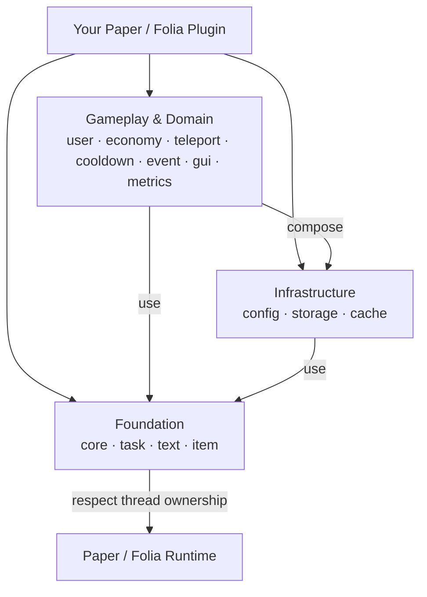

<div align="center">

# Cotani

**Composable, high-performance infrastructure for safe, non-blocking Paper and Folia plugins.**

Build scalable Minecraft plugins with explicit execution boundaries, zero-reflection events, reactive GUIs, and robust persistence.

[](https://github.com/HanielCota/Cotani/actions/workflows/ci.yml)
[](https://adoptium.net/)
[](https://papermc.io/)
[](https://hanielcota.github.io/Cotani/)
[](https://jitpack.io/#HanielCota/Cotani)
[](LICENSE)

[English](README.md) · [Português](README.pt-BR.md)

[Overview](#overview) · [Compatibility](#compatibility) · [Installation](#installation) · [Modules](#choose-your-modules) · [Architecture](#architecture) · [Quick start](#five-minute-quick-start) · [Troubleshooting](#troubleshooting) · [Documentation](#documentation)

---

</div>

## Overview

Cotani is a modern Java 25 multi-module framework designed for Paper and Folia plugin development. It replaces fragile global state and main-thread blocking with explicit thread transitions, composable `CompletionStage` APIs, and clean domain isolation.

| Concern | Cotani Approach |
| :--- | :--- |
| **🧵 Thread Ownership** | Global, region, and entity transitions managed through `PaperTaskScheduler` and `TaskChain` |
| **⚡ Asynchronous Work** | Composable `CompletionStage` APIs with explicit executors — no hidden blocking or `join()` |
| **💾 Persistence** | SQLite, MySQL, and MariaDB drivers with automated schema migrations and transaction runners |
| **🧠 State & Caching** | Caffeine-backed caches with automatic dirty tracking, bulk flushing, and invalidation contracts |
| **🔄 Plugin Lifecycle** | Centralized ownership, reverse-order disposal, and non-blocking shutdown of registered resources |
| **🛡️ API Quality** | Immutable records, strict null-safety, and isolated implementation packages |

---

## Compatibility

| Cotani Version | Java Version | Paper API | Release Status | Included Modules |
| :--- | :---: | :---: | :--- | :--- |
| `1.0.0` | 25 | 26.2 | Stable tag on JitPack | Core, task, text, item, config, storage, cache, user, economy, cooldown, teleport, event |
| `1.1.0-SNAPSHOT` | 25 | 26.2 | Source or commit build only | All stable modules plus BOM, reactive GUI, and Micrometer metrics |

> [!NOTE]
> `1.0.0` is the latest tagged release. Do not use the literal version `1.1.0` until that release tag is published. Documentation on `master` reflects the active snapshot; browse the [`1.0.0` tag](https://github.com/HanielCota/Cotani/tree/1.0.0) for the published release API.

---

## Installation

### Stable Release (`1.0.0`)

Add PaperMC and JitPack to your build script repositories, then declare only the top-level modules your plugin needs:

```kotlin
repositories {
    mavenCentral()
    maven("https://repo.papermc.io/repository/maven-public/")
    maven("https://jitpack.io")
}

dependencies {
    val cotaniVersion = "1.0.0"

    implementation("com.github.HanielCota.Cotani:cotani-task:$cotaniVersion")
    implementation("com.github.HanielCota.Cotani:cotani-storage:$cotaniVersion")
}
```

Gradle automatically resolves internal Cotani dependencies transitively (e.g. `cotani-core` is pulled in when `cotani-task` is declared).

### Current Snapshot & BOM Alignment

To align versions across all Cotani modules using the Bill of Materials (BOM), publish the snapshot locally:

```bash
./gradlew publishToMavenLocal
```

Then consume the aligned BOM in your plugin:

```kotlin
repositories {
    mavenLocal()
    mavenCentral()
    maven("https://repo.papermc.io/repository/maven-public/")
}

dependencies {
    implementation(platform("com.cotani:cotani-bom:1.1.0-SNAPSHOT"))
    implementation("com.cotani:cotani-task")
    implementation("com.cotani:cotani-storage")
    implementation("com.cotani:cotani-gui")
}
```

> [!IMPORTANT]
> Cotani modules are libraries, not standalone server plugins. Shade and relocate `com.cotani` (and `net.cotani` if using metrics) into your plugin's private namespace using Gradle Shadow.

---

## Choose Your Modules

Declare only the modules required for your feature set; transitive dependencies are included automatically.

### 🧱 Foundation & Execution

| Module | Capability | Availability |
| :--- | :--- | :---: |
| [`cotani-core`](cotani-core/README.md) | Centralized plugin lifecycle and safe resource disposal | `1.0.0` |
| [`cotani-task`](cotani-task/README.md) | Async, global, region, and entity scheduling with fluent `TaskChain` | `1.0.0` |
| [`cotani-text`](cotani-text/README.md) | MiniMessage parsing, audience messaging, and placeholder resolvers | `1.0.0` |
| [`cotani-item`](cotani-item/README.md) | Fluent Paper 1.21+ data-component item, armor, and skull builders | `1.0.0` |

### ⚙️ Infrastructure & Persistence

| Module | Capability | Availability |
| :--- | :--- | :---: |
| [`cotani-config`](cotani-config/README.md) | YAML binding to immutable records with constraint validation & async reload | `1.0.0` |
| [`cotani-storage`](cotani-storage/README.md) | SQLite, MySQL, and MariaDB queries, schema migrations, and transactions | `1.0.0` |
| [`cotani-cache`](cotani-cache/README.md) | Caffeine-backed caches with automatic dirty-tracking and persistence | `1.0.0` |

### 🎮 Gameplay & Domain Systems

| Module | Capability | Availability |
| :--- | :--- | :---: |
| [`cotani-user`](cotani-user/README.md) | Async user profile loading, online cache, and session management | `1.0.0` |
| [`cotani-economy`](cotani-economy/README.md) | Exact `BigDecimal` economy, atomic transactions, and idempotency guarantees | `1.0.0` |
| [`cotani-cooldown`](cotani-cooldown/README.md) | Local and distributed SQL-backed cooldown limits with automatic pruning | `1.0.0` |
| [`cotani-teleport`](cotani-teleport/README.md) | Policy-driven teleport pipelines with hazard checks, combat tags & delays | `1.0.0` |
| [`cotani-event`](cotani-event/README.md) | Reflection-free, high-performance event bus with priority dispatching | `1.0.0` |
| [`cotani-gui`](cotani-gui/README.md) | Reactive inventory UIs with declarative structure, pagination & anti-dupe guards | `1.1.0-SNAPSHOT` |
| [`cotani-display`](cotani-display/README.md) | Modern Display Entity engine for text, item, and block holograms | `1.1.0-SNAPSHOT` |

### 📊 Operations & Tooling

| Module | Capability | Availability |
| :--- | :--- | :---: |
| [`cotani-metrics`](cotani-metrics/README.md) | Micrometer metrics collector with optional Prometheus HTTP export | `1.1.0-SNAPSHOT` |
| [`cotani-bom`](cotani-bom/README.md) | Bill of Materials for version alignment across all Cotani modules | `1.1.0-SNAPSHOT` |

---

## Architecture

Cotani is organized into clean architectural layers. Feature modules compose infrastructure and foundation components instead of relying on mutable global singletons.


```mermaid
flowchart TB
    Plugin["Your Paper / Folia Plugin"]
    Features["Gameplay & Domain<br/>user · economy · teleport · cooldown · event · gui · metrics"]
    Infrastructure["Infrastructure<br/>config · storage · cache"]
    Foundation["Foundation<br/>core · task · text · item"]
    Runtime["Paper / Folia Runtime"]

    Plugin --> Features
    Plugin --> Infrastructure
    Plugin --> Foundation
    Features -->|compose| Infrastructure
    Features -->|use| Foundation
    Infrastructure -->|use| Foundation
    Foundation -->|respect thread ownership| Runtime
```

Read the [complete architecture reference](docs/architecture.md) for the full dependency graph and thread-boundary sequence diagrams.

---

## Five-Minute Quick Start

This walkthrough sets up a shaded Paper plugin that reads player data asynchronously and safely returns to the player's entity thread before modifying game state.

### 1. Configure Gradle

`build.gradle.kts`:

```kotlin
plugins {
    java
    id("com.gradleup.shadow") version "9.6.1"
}

group = "com.example"
version = "0.1.0"

java {
    toolchain.languageVersion.set(JavaLanguageVersion.of(25))
}

repositories {
    mavenCentral()
    maven("https://repo.papermc.io/repository/maven-public/")
    maven("https://jitpack.io")
}

dependencies {
    compileOnly("io.papermc.paper:paper-api:26.2.build.85-stable")
    implementation("com.github.HanielCota.Cotani:cotani-task:e2f91df")
}

tasks.shadowJar {
    archiveClassifier.set("")
    mergeServiceFiles()
    relocate("com.cotani", "com.example.cotaniquickstart.libs.cotani")
}

tasks.build {
    dependsOn(tasks.shadowJar)
}
```

### 2. Describe the Plugin

`src/main/resources/plugin.yml`:

```yaml
name: CotaniQuickStart
version: '0.1.0'
main: com.example.cotaniquickstart.CotaniQuickStartPlugin
description: Minimal Cotani example
api-version: '26.2'
commands:
  cotanihello:
    description: Confirms that Cotani is running
    usage: /cotanihello
```

### 3. Add the Plugin Bootstrap

Use the compile-checked [`CotaniQuickStartPlugin`](docs-examples/src/main/java/com/example/cotaniquickstart/CotaniQuickStartPlugin.java). It demonstrates thin lifecycle ownership, constructor injection, and safe entity task transitions:

```java
public final class CotaniQuickStartPlugin extends JavaPlugin {

    private Cotani cotani;
    private PaperTaskScheduler scheduler;

    @Override
    public void onEnable() {
        this.scheduler = SchedulerFactory.create(this);
        this.cotani = Cotani.forPlugin(this)
            .withAsync(scheduler::closeAsync)
            .build();
    }

    @Override
    public void onDisable() {
        if (cotani != null) {
            cotani.closeAsync().exceptionally(error -> {
                getLogger().log(Level.SEVERE, "Error shutting down Cotani", error);
                return null;
            });
        }
    }
}
```

### 4. Async to Entity-Thread Transition

When an asynchronous query or service completes, retain the player `UUID` and transition back to the entity thread using `TaskChain`:

```java
UUID playerId = player.getUniqueId();
CompletionStage<String> messageStage = messageService.loadAsync(playerId);

scheduler.chain(messageStage)
    .consumeEntity(playerId, message -> {
        // Safe to interact with Bukkit/Paper objects on the player thread
        var onlinePlayer = Bukkit.getPlayer(playerId);
        if (onlinePlayer != null) {
            onlinePlayer.sendMessage(Component.text(message));
        }
    })
    .toCompletionStage()
    .whenComplete((_, failure) -> {
        if (failure != null) {
            logger.log(Level.SEVERE, "Could not message player " + playerId, failure);
        }
    });
```

> [!WARNING]
> Never call `join()`, `get()`, or `Thread.sleep(...)` in server code. Never carry live `Player`, `World`, `Entity`, `Inventory`, or `Block` objects across asynchronous boundaries.

---

## Troubleshooting

| Symptom | Likely Cause | Solution |
| :--- | :--- | :--- |
| JitPack cannot resolve `1.1.0` | The release tag is not yet published | Use stable `1.0.0`, a commit hash build, or publish locally via `publishToMavenLocal` |
| `NoClassDefFoundError: com/cotani/...` | Unshaded jar deployed | Build and deploy the output of `shadowJar` with relocate configured |
| Async-catcher or wrong-thread exception | Bukkit API accessed in async lambda | Capture `UUID`s and return via `scheduler.chain(...).consumeEntity(...)` |
| Server stalls during command execution | Blocking call (`join()`, `get()`, I/O) on main thread | Compose with `CompletionStage`; eliminate synchronous database/file calls |
| GUI opens but click actions are ignored | `CotaniGuiModule` was not registered | Register `CotaniGuiModule.create(plugin)` inside `Cotani.forPlugin(plugin)` |
| Database integration tests do not start | Docker is unavailable | Start Docker daemon and ensure `docker info` succeeds before running `./gradlew integrationTest` |

---

## Documentation & Resources

- 📖 **[Cotani Cookbook](docs/ai/cotani-cookbook.md)** — Copy-paste recipes for common Paper plugin patterns
- 🌐 **[API Documentation (Javadoc)](https://hanielcota.github.io/Cotani/)** — Aggregated Javadoc reference for all modules
- 💡 **[Showcase Plugin Examples](docs-examples/src/main/java/com/cotani/examples/showcase/ShowcasePlugin.java)** — Full compile-checked reference plugin implementation
- 🏗️ **[Architecture Reference](docs/architecture.md)** — Gradle dependency graphs and execution boundaries
- 📜 **[Asynchronous API Contracts](docs/async-contracts.md)** — Non-blocking guarantees and error propagation rules
- 🔄 **[1.x Migration Notes](docs/migration-1.x.md)** — Source-compatible upgrade guides

---

## Development

Clone the repository and run all checks using the included Gradle wrapper:

```bash
git clone https://github.com/HanielCota/Cotani.git
cd Cotani
./gradlew spotlessApply
./gradlew check
```

`check` validates unit tests, code formatting via Palantir, Error Prone, NullAway, compile-checked documentation examples, and module architectural boundaries. Docker-backed database suites are run separately:

```bash
./gradlew integrationTest
```

Review our [Contributing Guide](CONTRIBUTING.md), [Security Policy](SECURITY.md), and [Engineering Rules](AGENTS.md) before submitting contributions.
