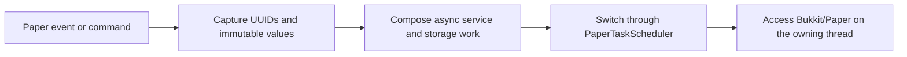

<div align="center">

# Cotani

**Modular, async-safe building blocks for Paper and Folia plugins.**

[](https://github.com/HanielCota/Cotani/actions/workflows/ci.yml)
[](https://adoptium.net/)
[](https://papermc.io/)
[](https://jitpack.io/#HanielCota/Cotani)
[](LICENSE)

[Overview](#overview) · [Installation](#installation) · [Modules](#modules) · [Quick start](#quick-start) · [Development](#development)

</div>

## Overview

Cotani is a Java 25 multi-module library for building Paper and Folia plugins with explicit execution boundaries. It provides scheduling, persistence, caching, configuration, user, economy, teleport, cooldown, event, GUI, text, item and metrics APIs without turning the plugin main class into a service locator.

The project is built around a few invariants:

- public asynchronous APIs expose composable `CompletionStage` or `TaskChain` results;
- database and file I/O stay off server-owned threads;
- Bukkit and Paper objects are accessed only from the thread that owns them;
- services receive dependencies through constructors;
- resources have explicit, non-blocking shutdown paths;
- mutable state and collections are isolated behind clear contracts.


```mermaid
flowchart LR
    A["Paper event or command"] --> B["Capture UUIDs and immutable values"]
    B --> C["Compose async service and storage work"]
    C --> D["Switch through PaperTaskScheduler"]
    D --> E["Access Bukkit/Paper on the owning thread"]
```

## Requirements

- JDK 25
- Paper API 26.2 for Paper-dependent modules
- Gradle Wrapper for building the repository
- Docker only for the MySQL and MariaDB integration-test suites

> [!IMPORTANT]
> Cotani modules are libraries, not a standalone server plugin. Package the modules your plugin uses with your normal shading and relocation setup unless your deployment provides them separately.

## Installation

The latest tagged version is `1.0.0` and is available through JitPack. Add JitPack and Paper's Maven repository to `settings.gradle.kts`:

```kotlin
dependencyResolutionManagement {
    repositories {
        mavenCentral()
        maven("https://repo.papermc.io/repository/maven-public/")
        maven("https://jitpack.io")
    }
}
```

Then select only the modules your plugin needs:

```kotlin
dependencies {
    val cotaniVersion = "1.0.0"

    implementation("com.github.HanielCota.Cotani:cotani-core:$cotaniVersion")
    implementation("com.github.HanielCota.Cotani:cotani-task:$cotaniVersion")
    implementation("com.github.HanielCota.Cotani:cotani-storage:$cotaniVersion")
    implementation("com.github.HanielCota.Cotani:cotani-cache:$cotaniVersion")
}
```

> [!NOTE]
> The current source tree is `1.0.1-SNAPSHOT`. The `cotani-gui` and `cotani-metrics` modules were added after tag `1.0.0`; use a commit-based JitPack version only when intentionally testing unreleased code.

JitPack also provides the equivalent Maven and Groovy DSL snippets on the [Cotani package page](https://jitpack.io/#HanielCota/Cotani).

## Modules

| Module | Purpose |
| --- | --- |
| [`cotani-core`](cotani-core/README.md) | Lifecycle ownership and coalesced resource shutdown |
| [`cotani-task`](cotani-task/README.md) | Async, global, region and entity scheduling with `TaskChain` |
| [`cotani-storage`](cotani-storage/README.md) | SQLite, MySQL and MariaDB access, migrations and transactions |
| [`cotani-cache`](cotani-cache/README.md) | Caffeine-backed data and player caches with persistence |
| [`cotani-config`](cotani-config/README.md) | YAML binding to immutable records, validation and async reload |
| [`cotani-user`](cotani-user/README.md) | Async user resolution and session lifecycle |
| [`cotani-economy`](cotani-economy/README.md) | Precise, idempotent and auditable economy operations |
| [`cotani-teleport`](cotani-teleport/README.md) | Policy-driven teleport pipelines and safety checks |
| [`cotani-cooldown`](cotani-cooldown/README.md) | Local and distributed cooldown acquisition |
| [`cotani-event`](cotani-event/README.md) | Reflection-free event dispatch and subscriptions |
| [`cotani-gui`](cotani-gui/README.md) | Declarative inventory UIs with reactive state and exploit guards |
| [`cotani-metrics`](cotani-metrics/) | Micrometer metrics and optional Prometheus export |
| [`cotani-text`](cotani-text/README.md) | Adventure and MiniMessage formatting helpers |
| [`cotani-item`](cotani-item/README.md) | Fluent Paper data-component item builders |

## Quick start

Create one scheduler during plugin startup and register its asynchronous shutdown with the Cotani lifecycle:

```java
public final class MyPlugin extends JavaPlugin {

    private Cotani lifecycle;
    private PaperTaskScheduler scheduler;

    @Override
    public void onEnable() {
        scheduler = SchedulerFactory.create(this);
        lifecycle = Cotani.forPlugin(this)
            .withAsync(scheduler::closeAsync)
            .build();
    }

    @Override
    public void onDisable() {
        if (lifecycle == null) {
            return;
        }

        lifecycle.closeAsync().exceptionally(failure -> {
            getLogger().log(Level.SEVERE, "Could not close Cotani resources", failure);
            return null;
        });
    }
}
```

When an asynchronous service result needs to touch a player, retain the UUID and return through the entity scheduler:

```java
UUID playerId = player.getUniqueId();

scheduler.chain(userService.findAsync(playerId))
    .consumeEntity(playerId, user -> {
        Player onlinePlayer = Bukkit.getPlayer(playerId);
        if (onlinePlayer == null) {
            return;
        }

        user.ifPresent(profile -> onlinePlayer.sendMessage(
            Component.text("Welcome back, " + profile.username() + "!")
        ));
    })
    .toCompletionStage()
    .exceptionally(failure -> {
        getLogger().log(Level.SEVERE, "Could not load user " + playerId, failure);
        return null;
    });
```

> [!WARNING]
> Never call `join()`, `get()` or `Thread.sleep(...)` in application code. Do not capture live `Player`, `World`, `Entity`, `Inventory` or `Block` objects in asynchronous flows.

Detailed usage examples live in each module README. The [Cotani cookbook](docs/ai/cotani-cookbook.md) collects end-to-end plugin recipes.

## Development

Clone the repository and run the checks with the included wrapper:

```bash
git clone https://github.com/HanielCota/Cotani.git
cd Cotani
./gradlew spotlessApply
./gradlew check
```

`check` runs unit tests, formatting validation, Error Prone, NullAway and module-boundary checks. With Docker available, it also exercises the MySQL and MariaDB integration suites.

Additional project references:

- [Architecture and engineering rules](AGENTS.md)
- [Contributor workflow](CONTRIBUTING.md)
- [Security policy](SECURITY.md)
- [Full architecture audit](docs/review/full-architecture-audit.md)
