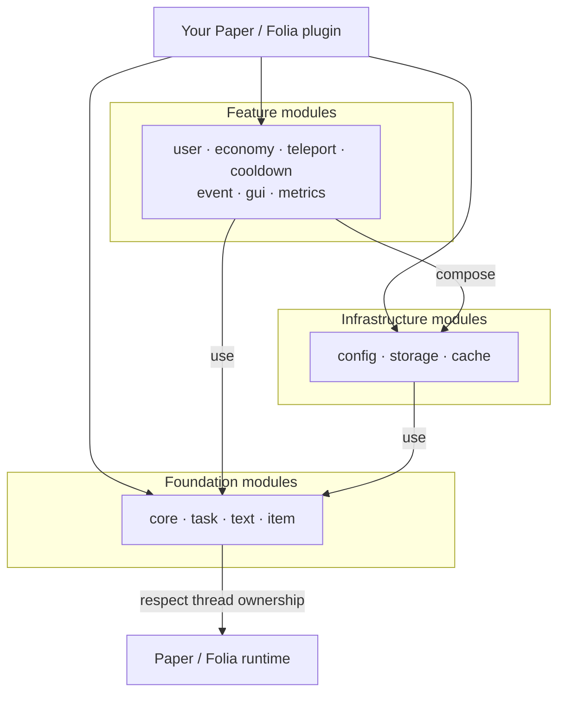
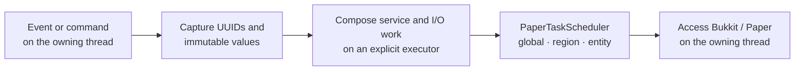

<div align="center">

# Cotani

**Composable infrastructure for safe, non-blocking Paper and Folia plugins.**

Build with only the scheduling, storage, cache, configuration and gameplay modules your plugin needs.

[](https://github.com/HanielCota/Cotani/actions/workflows/ci.yml)
[](https://adoptium.net/)
[](https://papermc.io/)
[](https://jitpack.io/#HanielCota/Cotani)
[](LICENSE)

[Overview](#overview) · [Architecture](#architecture) · [Installation](#installation) · [Modules](#modules) · [Quick start](#quick-start) · [Development](#development)

</div>

## Overview

Cotani is a Java 25 multi-module library for building Paper and Folia plugins with explicit execution boundaries. It provides focused APIs for scheduling, persistence, caching, configuration and common gameplay systems without turning the plugin main class into a service locator.

| Concern | Cotani approach |
| --- | --- |
| Thread ownership | Global, region and entity transitions through `PaperTaskScheduler` and `TaskChain` |
| Asynchronous work | Composable `CompletionStage` APIs and explicit executors—no hidden blocking |
| Persistence | SQLite, MySQL and MariaDB providers with migrations and transactions |
| State | Caffeine-backed caches with loading, persistence and invalidation contracts |
| Plugin lifecycle | Centralized ownership and non-blocking shutdown of registered resources |
| API quality | Immutable values, null-safe contracts and isolated implementation packages |

Choose individual modules for a small dependency surface, or use the BOM to keep their versions aligned.

## Architecture

Cotani is organized in layers. Feature modules compose the infrastructure and foundation modules instead of reaching through global state.


```mermaid
flowchart TB
    Plugin["Your Paper / Folia plugin"]

    subgraph Features["Feature modules"]
        FeatureModules["user · economy · teleport · cooldown<br/>event · gui · metrics"]
    end

    subgraph Infrastructure["Infrastructure modules"]
        InfrastructureModules["config · storage · cache"]
    end

    subgraph Foundation["Foundation modules"]
        FoundationModules["core · task · text · item"]
    end

    Runtime["Paper / Folia runtime"]

    Plugin --> FeatureModules
    Plugin --> InfrastructureModules
    Plugin --> FoundationModules
    FeatureModules -->|compose| InfrastructureModules
    FeatureModules -->|use| FoundationModules
    InfrastructureModules -->|use| FoundationModules
    FoundationModules -->|respect thread ownership| Runtime
```

The usual execution path captures immutable values on the server thread, performs I/O on an explicit executor and returns through the correct scheduler before accessing Bukkit or Paper objects:


```mermaid
flowchart LR
    Event["Event or command<br/>on the owning thread"]
    Capture["Capture UUIDs and<br/>immutable values"]
    Async["Compose service and I/O work<br/>on an explicit executor"]
    Scheduler["PaperTaskScheduler<br/>global · region · entity"]
    Paper["Access Bukkit / Paper<br/>on the owning thread"]

    Event --> Capture --> Async --> Scheduler --> Paper
```

## Requirements

- JDK 25
- Paper API 26.2 for Paper-dependent modules
- Gradle Wrapper to build the repository
- Docker only for the MySQL and MariaDB integration-test suites

> [!IMPORTANT]
> Cotani modules are libraries, not standalone server plugins. Shade and relocate the modules your plugin uses unless your deployment provides them separately.

## Installation

The examples below target the stable `1.0.0` tag published through JitPack. Add JitPack and Paper's Maven repository to `settings.gradle.kts`:

```kotlin
dependencyResolutionManagement {
    repositories {
        mavenCentral()
        maven("https://repo.papermc.io/repository/maven-public/")
        maven("https://jitpack.io")
    }
}
```

Then select only the modules your plugin needs:

```kotlin
dependencies {
    val cotaniVersion = "1.0.0"

    implementation("com.github.HanielCota.Cotani:cotani-core:$cotaniVersion")
    implementation("com.github.HanielCota.Cotani:cotani-task:$cotaniVersion")
    implementation("com.github.HanielCota.Cotani:cotani-storage:$cotaniVersion")
    implementation("com.github.HanielCota.Cotani:cotani-cache:$cotaniVersion")
}
```

> [!NOTE]
> The current source tree is `1.0.1-SNAPSHOT`. The BOM, GUI and metrics modules were added after tag `1.0.0`; use a commit-based JitPack version only when intentionally testing unreleased code.

From `1.0.1` onward, use `cotani-bom` to align module versions:

```kotlin
dependencies {
    implementation(platform("com.github.HanielCota.Cotani:cotani-bom:1.0.1"))
    implementation("com.github.HanielCota.Cotani:cotani-task")
    implementation("com.github.HanielCota.Cotani:cotani-storage")
}
```

Equivalent Maven and Groovy DSL snippets are available on the [Cotani JitPack page](https://jitpack.io/#HanielCota/Cotani).

## Modules

| Module | Purpose |
| --- | --- |
| `cotani-bom` | Version alignment for all published modules |
| [`cotani-core`](cotani-core/README.md) | Lifecycle ownership and coalesced resource shutdown |
| [`cotani-task`](cotani-task/README.md) | Async, global, region and entity scheduling with `TaskChain` |
| [`cotani-storage`](cotani-storage/README.md) | SQLite, MySQL and MariaDB access, migrations and transactions |
| [`cotani-cache`](cotani-cache/README.md) | Caffeine-backed data and player caches with persistence |
| [`cotani-config`](cotani-config/README.md) | YAML binding to immutable records, validation and async reload |
| [`cotani-user`](cotani-user/README.md) | Async user resolution and session lifecycle |
| [`cotani-economy`](cotani-economy/README.md) | Precise, idempotent and auditable economy operations |
| [`cotani-teleport`](cotani-teleport/README.md) | Policy-driven teleport pipelines and safety checks |
| [`cotani-cooldown`](cotani-cooldown/README.md) | Local and distributed cooldown acquisition |
| [`cotani-event`](cotani-event/README.md) | Reflection-free event dispatch and subscriptions |
| [`cotani-gui`](cotani-gui/README.md) | Declarative inventory UIs with reactive state and exploit guards |
| [`cotani-metrics`](cotani-metrics/README.md) | Micrometer metrics and optional Prometheus export |
| [`cotani-text`](cotani-text/README.md) | Adventure and MiniMessage formatting helpers |
| [`cotani-item`](cotani-item/README.md) | Fluent Paper data-component item builders |

Each module README documents its public API, setup and usage. The root project does not force an all-in-one dependency.

## Quick start

Create one scheduler during plugin startup and register its asynchronous shutdown with the Cotani lifecycle:

```java
public final class MyPlugin extends JavaPlugin {

    private Cotani lifecycle;
    private PaperTaskScheduler scheduler;

    @Override
    public void onEnable() {
        scheduler = SchedulerFactory.create(this);
        lifecycle = Cotani.forPlugin(this)
            .withAsync(scheduler::closeAsync)
            .build();
    }

    @Override
    public void onDisable() {
        if (lifecycle == null) {
            return;
        }

        lifecycle.closeAsync().exceptionally(failure -> {
            getLogger().log(Level.SEVERE, "Could not close Cotani resources", failure);
            return null;
        });
    }
}
```

When an asynchronous result needs to interact with a player, retain the UUID and return through the entity scheduler:

```java
UUID playerId = player.getUniqueId();

scheduler.chain(userService.findAsync(playerId))
    .consumeEntity(playerId, user -> {
        Player onlinePlayer = Bukkit.getPlayer(playerId);
        if (onlinePlayer == null) {
            return;
        }

        user.ifPresent(profile -> onlinePlayer.sendMessage(
            Component.text("Welcome back, " + profile.username() + "!")
        ));
    })
    .toCompletionStage()
    .exceptionally(failure -> {
        getLogger().log(Level.SEVERE, "Could not load user " + playerId, failure);
        return null;
    });
```

> [!WARNING]
> Never call `join()`, `get()` or `Thread.sleep(...)` in application code. Do not capture live `Player`, `World`, `Entity`, `Inventory` or `Block` objects in asynchronous flows.

## Documentation

- [Cotani cookbook](docs/ai/cotani-cookbook.md) — end-to-end plugin recipes
- [Asynchronous API contracts](docs/async-contracts.md) — execution and failure semantics
- [Cotani 1.x migration notes](docs/migration-1.x.md) — compatibility guidance
- [Compile-checked examples](docs-examples/src/main/java/com/cotani/examples/CotaniExamples.java) — examples validated by the build

## Development

Clone the repository and run the checks with the included wrapper:

```bash
git clone https://github.com/HanielCota/Cotani.git
cd Cotani
./gradlew spotlessApply
./gradlew check
```

`check` runs unit tests, formatting validation, Error Prone, NullAway, compile-checked documentation examples and module-boundary checks. Database integration tests are deliberately separate:

```bash
./gradlew integrationTest
```

The integration task uses Docker-backed MySQL and MariaDB containers. CI verifies Docker first so a missing daemon cannot produce a false-green build.

Project references:

- [Architecture and engineering rules](AGENTS.md)
- [Contributor workflow](CONTRIBUTING.md)
- [Security policy](SECURITY.md)
- [Full architecture audit](docs/review/full-architecture-audit.md)
