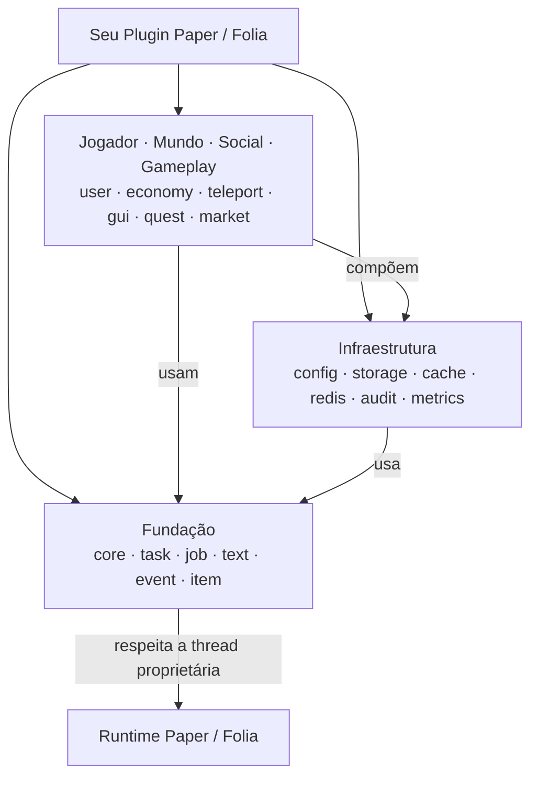

<div align="center">


# Cotani

**Infraestrutura componível e de alta performance para plugins Paper e Folia seguros e não bloqueantes.**

Construa plugins Minecraft escaláveis com limites de execução explícitos, eventos sem reflexão, interfaces reativas e persistência robusta.

[](https://github.com/HanielCota/Cotani/actions/workflows/ci.yml)
[](https://adoptium.net/)
[](https://papermc.io/)
[](https://hanielcota.github.io/Cotani/api/)
[](https://jitpack.io/#HanielCota/Cotani)
[](LICENSE)

[English](README.md) · [Português](README.pt-BR.md)

[Visão geral](#visão-geral) · [Compatibilidade](#compatibilidade) · [Instalação](#instalação) · [Módulos](#escolha-seus-módulos) · [Arquitetura](#arquitetura) · [Início rápido](#início-rápido-em-cinco-minutos) · [Solução de problemas](#solução-de-problemas) · [Documentação](#documentação--recursos)

---

</div>

## Visão geral

Cotani é um framework moderno Java 25 multimódulo projetado para desenvolvimento de plugins no ecossistema Paper e Folia. Ele elimina o estado global frágil e bloqueios da thread principal com transições explícitas de thread, APIs componíveis baseadas em `CompletionStage` e isolamento limpo de domínio.

| Necessidade | Abordagem do Cotani |
| :--- | :--- |
| **🧵 Thread Proprietária** | Transições global, region e entity gerenciadas via `PaperTaskScheduler` e `TaskChain` |
| **⚡ Trabalho Assíncrono** | APIs componíveis com `CompletionStage` e executors explícitos — sem bloqueios ocultos ou `join()` |
| **💾 Persistência** | Drivers SQLite, MySQL e MariaDB com migrações automáticas de schema e executor de transações |
| **🧠 Estado & Cache** | Caches baseados em Caffeine com dirty-tracking automático, flush em lote e contratos de invalidação |
| **🔄 Lifecycle do Plugin** | Propriedade centralizada, descarte em ordem inversa e encerramento não bloqueante de recursos |
| **🛡️ Qualidade de API** | Records imutáveis, null-safety rigoroso e pacotes de implementação isolados |

---

## Compatibilidade

| Versão Cotani | Versão Java | Paper API | Status do Release | Módulos Incluídos |
| :--- | :---: | :---: | :--- | :--- |
| `1.1.2` | 25 | 26.2 (`26.2.build.116-stable`) | Tag estável no JitPack | Todos os módulos publicados |
| `1.0.0` | 25 | 26.2 | Tag legado no JitPack | Core, task, text, item, config, storage, cache, user, economy, cooldown, teleport, event |

---

## Instalação

### Versão Estável (`1.1.2`)

Adicione o repositório do PaperMC e do JitPack no seu script de build e declare apenas os módulos de alto nível que seu plugin utiliza:

```kotlin
repositories {
    mavenCentral()
    maven("https://repo.papermc.io/repository/maven-public/")
    maven("https://jitpack.io")
}

dependencies {
    val cotaniVersion = "v1.1.2"

    implementation("com.github.HanielCota.Cotani:cotani-task:$cotaniVersion")
    implementation("com.github.HanielCota.Cotani:cotani-storage:$cotaniVersion")
}
```

O Gradle resolve automaticamente as dependências internas do Cotani de forma transitiva (por exemplo, `cotani-core` é importado automaticamente ao declarar `cotani-task`).

### Alinhamento de versões com BOM

Para alinhar as versões de todos os módulos Cotani, consuma o Bill of Materials (BOM) publicado:

```kotlin
repositories {
    mavenCentral()
    maven("https://repo.papermc.io/repository/maven-public/")
    maven("https://jitpack.io")
}

dependencies {
    val cotaniVersion = "v1.1.2"
    implementation(platform("com.github.HanielCota.Cotani:cotani-bom:$cotaniVersion"))
    implementation("com.github.HanielCota.Cotani:cotani-task")
    implementation("com.github.HanielCota.Cotani:cotani-storage")
    implementation("com.github.HanielCota.Cotani:cotani-gui")
}
```

Ao consumir um checkout local, execute `./gradlew publishToMavenLocal`, adicione `mavenLocal()` e use as coordenadas
`com.cotani` documentadas em [`cotani-bom/README.md`](cotani-bom/README.md).

### GitHub Packages (alternativa autenticada)

Cada release com tag também é publicada no GitHub Packages com sources, Javadocs, metadados Gradle e POMs Maven. O
GitHub exige um personal access token clássico com `read:packages`, inclusive para pacotes Maven públicos:

```kotlin
repositories {
    maven {
        url = uri("https://maven.pkg.github.com/HanielCota/Cotani")
        credentials {
            username = System.getenv("GITHUB_PACKAGES_USER")
            password = System.getenv("GITHUB_PACKAGES_TOKEN")
        }
    }
}

dependencies {
    val cotaniVersion = "1.1.2"
    implementation(platform("com.cotani:cotani-bom:$cotaniVersion"))
    implementation("com.cotani:cotani-task")
}
```

Mantenha o token fora do script de build. Para resolução pública e anônima, use as coordenadas JitPack acima.

> [!IMPORTANT]
> Os módulos Cotani são bibliotecas, não plugins de servidor independentes. Faça o shadow e relocation de `com.cotani` para o namespace privado do seu plugin usando o Gradle Shadow.

---

## Escolha seus Módulos

Declare apenas os módulos necessários para o seu conjunto de funcionalidades; as dependências transitivas são incluídas automaticamente.

### 🧱 Fundação & Execução

| Módulo | Capacidade | Disponibilidade |
| :--- | :--- | :---: |
| [`cotani-core`](cotani-core/README.md) | Lifecycle centralizado do plugin e descarte seguro de recursos | `1.1.2` |
| [`cotani-task`](cotani-task/README.md) | Agendamento async, global, region e entity com o fluente `TaskChain` | `1.1.2` |
| [`cotani-job`](cotani-job/README.md) | Jobs nomeados persistentes com retries, recorrência, cancelamento e recuperação após reinício | `1.1.2` |
| [`cotani-text`](cotani-text/README.md) | Parsing de MiniMessage, envio para audiências e resolução de placeholders | `1.1.2` |
| [`cotani-event`](cotani-event/README.md) | Event Bus de alta performance e livre de reflexão com despacho por prioridades | `1.1.2` |
| [`cotani-item`](cotani-item/README.md) | Builders fluentes de itens, armaduras e cabeças com data components do Paper 1.21+ | `1.1.2` |

### ⚙️ Infraestrutura & Persistência

| Módulo | Capacidade | Disponibilidade |
| :--- | :--- | :---: |
| [`cotani-config`](cotani-config/README.md) | Mapeamento de YAML para records imutáveis com validação de restrições e reload async | `1.1.2` |
| [`cotani-storage`](cotani-storage/README.md) | Consultas SQLite, MySQL e MariaDB, migrações de schema e transações | `1.1.2` |
| [`cotani-cache`](cotani-cache/README.md) | Caches baseados em Caffeine com dirty-tracking automático e persistência | `1.1.2` |
| [`cotani-redis`](cotani-redis/README.md) | Cliente Redis não-bloqueante, mensageria pub/sub, locks distribuídos e sync | `1.1.2` |
| [`cotani-metrics`](cotani-metrics/README.md) | Coletor de métricas Micrometer com exportação opcional via HTTP Prometheus | `1.1.2` |

### 👤 Jogador & Conta

| Módulo | Capacidade | Disponibilidade |
| :--- | :--- | :---: |
| [`cotani-user`](cotani-user/README.md) | Carregamento assíncrono de perfis, cache online e gerenciamento de sessões | `1.1.2` |
| [`cotani-permission`](cotani-permission/README.md) | Nós de permissão, grupos, decisões de herança e persistência SQL assíncronos | `1.1.2` |
| [`cotani-economy`](cotani-economy/README.md) | Economia exata com `BigDecimal`, transações atômicas e garantias de idempotência | `1.1.2` |
| [`cotani-cooldown`](cotani-cooldown/README.md) | Limites de cooldown locais e distribuídos em SQL com limpeza automática | `1.1.2` |
| [`cotani-inventory`](cotani-inventory/README.md) | Snapshots binários de inventário, rollback e locks de transferência entre servidores | `1.1.2` |
| [`cotani-locale`](cotani-locale/README.md) | Preferências de idioma por jogador, fallback de catálogos e renderização segura de MiniMessage | `1.1.2` |

### 🌍 Mundo, UI & Plataforma

| Módulo | Capacidade | Disponibilidade |
| :--- | :--- | :---: |
| [`cotani-teleport`](cotani-teleport/README.md) | Pipelines de teleporte orientados a políticas com checagem de perigos, tags de combate e delays | `1.1.2` |
| [`cotani-location`](cotani-location/README.md) | Homes e warps imutáveis com persistência assíncrona e integração segura com teleporte | `1.1.2` |
| [`cotani-region`](cotani-region/README.md) | Regiões espaciais 3D, indexador por chunks, flags de proteção e eventos de transição | `1.1.2` |
| [`cotani-npc`](cotani-npc/README.md) | NPCs virtuais por pacote com look-at dinâmico, skins, equipamentos e raycasting de cliques | `1.1.2` |
| [`cotani-display`](cotani-display/README.md) | Motor moderno de Display Entities para hologramas de texto, itens e blocos | `1.1.2` |
| [`cotani-hud`](cotani-hud/README.md) | Scoreboards reativas zero-flicker, tablist dinâmico, bossbars e actionbars | `1.1.2` |
| [`cotani-nametag`](cotani-nametag/README.md) | Formatação de nametags via Scoreboard Teams, prioridade de ordenação no tablist e regras de colisão | `1.1.2` |
| [`cotani-gui`](cotani-gui/README.md) | Interfaces declarativas de inventário com estado reativo, paginação e proteção contra exploits | `1.1.2` |
| [`cotani-command`](cotani-command/README.md) | Framework declarativo de comandos com argumentos assíncronos, cooldowns e segurança para Folia | `1.1.2` |
| [`cotani-dialog`](cotani-dialog/README.md) | Diálogos reativos não-bloqueantes de chat, placa e bigorna com wizards | `1.1.2` |
| [`cotani-placeholder`](cotani-placeholder/README.md) | Expansão assíncrona de placeholders, integração MiniMessage e ponte para PlaceholderAPI | `1.1.2` |

### 🤝 Social & Multiplayer

| Módulo | Capacidade | Disponibilidade |
| :--- | :--- | :---: |
| [`cotani-party`](cotani-party/README.md) | Parties assíncronas com convites expiráveis, cargos, transferência de liderança e SPI de persistência | `1.1.2` |
| [`cotani-friend`](cotani-friend/README.md) | Amizades, solicitações, bloqueios, persistência otimista e eventos assíncronos | `1.1.2` |
| [`cotani-queue`](cotani-queue/README.md) | Filas prioritárias, tickets expiráveis, limite de capacidade e matchmaking atômico | `1.1.2` |
| [`cotani-trade`](cotani-trade/README.md) | Trocas entre jogadores com confirmação, ofertas imutáveis e liquidação idempotente | `1.1.2` |
| [`cotani-mail`](cotani-mail/README.md) | Correio persistente entre jogadores com TTL, envios idempotentes, paginação e persistência SQL | `1.1.2` |

### 🎮 Gameplay & Domínio

| Módulo | Capacidade | Disponibilidade |
| :--- | :--- | :---: |
| [`cotani-punishment`](cotani-punishment/README.md) | Banimentos, silenciamentos e advertências imutáveis com expiração, revogação e auditoria assíncrona | `1.1.2` |
| [`cotani-reward`](cotani-reward/README.md) | Recompensas persistentes com cooldowns, sequências, claims idempotentes, grants imutáveis e persistência SQL | `1.1.2` |
| [`cotani-reward-integration`](cotani-reward-integration/README.md) | Adaptadores de liquidação de moeda e inventário seguro por thread para recompensas | `1.1.2` |
| [`cotani-quest`](cotani-quest/README.md) | Quests orientadas a objetivos com progresso otimista, claims idempotentes, eventos e persistência SQL | `1.1.2` |
| [`cotani-statistics`](cotani-statistics/README.md) | Estatísticas assíncronas atômicas de jogadores com rankings limitados, eventos e persistência SQL | `1.1.2` |
| [`cotani-ranking`](cotani-ranking/README.md) | Rankings nomeados e limitados apoiados por `cotani-statistics` | `1.1.2` |
| [`cotani-achievement`](cotani-achievement/README.md) | Conquistas assíncronas com critérios de estatística, desbloqueios idempotentes, recompensas, eventos e progresso SQL | `1.1.2` |
| [`cotani-season`](cotani-season/README.md) | Temporadas com XP idempotente, níveis cumulativos, claims de recompensas, eventos e persistência SQL | `1.1.2` |
| [`cotani-market`](cotani-market/README.md) | Marketplace persistente de jogadores com anúncios limitados, compras idempotentes, settlement recuperável e persistência SQL | `1.1.2` |

### 🧹 Operações & Ferramentas

| Módulo | Capacidade | Disponibilidade |
| :--- | :--- | :---: |
| [`cotani-cleanup`](cotani-cleanup/README.md) | Limpeza segura de entidades do mundo com preview, políticas explícitas, lotes e segurança de threads Paper/Folia | `1.1.2` |
| [`cotani-audit`](cotani-audit/README.md) | Trilha de auditoria imutável, append-only e com consultas assíncronas limitadas | `1.1.2` |
| [`cotani-audit-storage`](cotani-audit-storage/README.md) | Adaptador SQL indexado e idempotente para eventos de auditoria | `1.1.2` |
| [`cotani-bom`](cotani-bom/README.md) | Bill of Materials para alinhamento de versões de todos os módulos | `1.1.2` |

Os grupos descrevem como os consumidores usam os módulos; eles não representam o grafo de dependências. Consulte o
[índice de módulos](docs/module-index.md) para dependências e orientação de escolha.

---

## Arquitetura

O Cotani é organizado em camadas arquiteturais limpas. Módulos de funcionalidades compõem componentes de infraestrutura e fundação em vez de depender de singletons globais mutáveis.



Consulte a [referência completa de arquitetura](docs/architecture.md) para visualizar o grafo completo de dependências e os diagramas de sequência de fronteiras de thread.

---

## Início Rápido em Cinco Minutos

Este guia configura um plugin Paper com shadow cujo comando `/cotanihello` captura o `UUID` do jogador, transita para a entity thread dele e só então acessa o estado do Bukkit/Paper.

### 1. Configure o Gradle

`build.gradle.kts`:

```kotlin
plugins {
    java
    id("com.gradleup.shadow") version "9.6.1"
}

group = "com.example"
version = "0.1.0"

java {
    toolchain.languageVersion.set(JavaLanguageVersion.of(25))
}

repositories {
    mavenCentral()
    maven("https://repo.papermc.io/repository/maven-public/")
    maven("https://jitpack.io")
}

dependencies {
    compileOnly("io.papermc.paper:paper-api:26.2.build.116-stable")
    implementation("com.github.HanielCota.Cotani:cotani-task:v1.1.2")
}

tasks.shadowJar {
    archiveClassifier.set("")
    mergeServiceFiles()
    relocate("com.cotani", "com.example.cotaniquickstart.libs.cotani")
}

tasks.build {
    dependsOn(tasks.shadowJar)
}
```

### 2. Descreva o Plugin

`src/main/resources/plugin.yml`:

```yaml
name: CotaniQuickStart
version: '0.1.0'
main: com.example.cotaniquickstart.CotaniQuickStartPlugin
description: Exemplo mínimo do Cotani
api-version: '26.2'
commands:
  cotanihello:
    description: Confirma que o Cotani está funcionando
    usage: /cotanihello
```

### 3. Adicione a Classe Principal do Plugin

Utilize o [`CotaniQuickStartPlugin` verificado por compilação](docs-examples/src/main/java/com/example/cotaniquickstart/CotaniQuickStartPlugin.java). Ele demonstra controle fino de lifecycle, injeção por construtor, registro de comandos e transições seguras para tarefas de entidade:

```java
public final class CotaniQuickStartPlugin extends JavaPlugin {

    private Cotani cotani;

    @Override
    public void onEnable() {
        var scheduler = SchedulerFactory.create(this);
        this.cotani = Cotani.forPlugin(this)
            .withAsync(scheduler::closeAsync)
            .build();

        var command = getCommand("cotanihello");

        if (command == null) {
            throw new IllegalStateException("Comando 'cotanihello' ausente no plugin.yml");
        }

        command.setExecutor(new HelloCommand(new HelloService(scheduler)));
    }

    @Override
    public void onDisable() {
        if (cotani != null) {
            cotani.closeAsync().whenComplete((_, failure) -> {
                if (failure != null) {
                    getLogger().log(Level.SEVERE, "Erro ao encerrar Cotani", failure);
                }
            });
        }
    }
}
```

Os records `HelloCommand` e `HelloService` são mostrados no próximo passo.

### 4. Capture IDs Imutáveis Antes de Acessar o Bukkit

Comandos validam o remetente e delegam imediatamente. O `HelloCommand` verifica o tipo do remetente e repassa apenas o `UUID`; o `HelloService` agenda a resposta na entity thread do jogador, de modo que objetos Bukkit/Paper sejam acessados apenas onde é seguro:

```java
record HelloCommand(HelloService helloService) implements CommandExecutor {

    @Override
    public boolean onCommand(CommandSender sender, Command command, String label, String[] arguments) {
        if (!(sender instanceof Player player)) {
            sender.sendMessage("Este comando só pode ser usado por um jogador.");
            return true;
        }

        helloService.greet(player.getUniqueId());

        return true;
    }
}

record HelloService(PaperTaskScheduler scheduler) {

    private void greet(UUID playerId) {
        Objects.requireNonNull(playerId, "playerId");

        scheduler.entity("cotani-hello", playerId, () -> {
            // Seguro para interagir com objetos Bukkit/Paper na entity thread do jogador
            var onlinePlayer = Bukkit.getPlayer(playerId);

            if (onlinePlayer != null) {
                onlinePlayer.sendMessage(Component.text("O Cotani está rodando na sua entity thread."));
            }
        });
    }
}
```

Ambos os records ficam dentro do [`CotaniQuickStartPlugin`](docs-examples/src/main/java/com/example/cotaniquickstart/CotaniQuickStartPlugin.java) no código-fonte verificado por compilação. Quando sua funcionalidade também executa trabalho assíncrono, como consultas ao banco de dados, comece pelo lado assíncrono, retenha apenas o `UUID` e retorne com `scheduler.chain(stage).consumeEntity(playerId, ...)`; o [Cookbook](docs/ai/cotani-cookbook.md) tem receitas completas.

> [!WARNING]
> Nunca chame `join()`, `get()` ou `Thread.sleep(...)` em código de servidor. Nunca carregue objetos vivos como `Player`, `World`, `Entity`, `Inventory` ou `Block` através de fronteiras assíncronas.

---

## Solução de Problemas

| Sintoma | Causa Provável | Solução |
| :--- | :--- | :--- |
| JitPack não resolve `v1.1.2` | Os metadados ou a tag não estão disponíveis para o resolvedor | Verifique o repositório do JitPack e confirme que a tag `v1.1.2` está disponível, ou publique localmente com `publishToMavenLocal` |
| `NoClassDefFoundError: com/cotani/...` | JAR sem shadow instalado no servidor | Compile e instale a saída do `shadowJar` com relocation configurado |
| Exceção de async-catcher ou thread incorreta | API Bukkit acessada dentro de lambda assíncrono | Capture `UUID`s e retorne via `scheduler.chain(...).consumeEntity(...)` |
| Servidor congela durante comandos | Chamada bloqueante (`join()`, `get()`, I/O) na main thread | Componha com `CompletionStage`; elimine chamadas síncronas de banco de dados ou arquivos |
| GUI abre, mas os cliques são ignorados | `CotaniGuiModule` não foi registrado | Registre `CotaniGuiModule.create(plugin)` dentro de `Cotani.forPlugin(plugin)` |
| Testes de integração de banco não iniciam | Docker não está disponível | Inicie o daemon do Docker e valide com `docker info` antes de executar `./gradlew integrationTest` |

---

## Documentação & Recursos

- 🚀 **[Site de Documentação](https://hanielcota.github.io/Cotani/)** — Guias publicados, mapa de módulos e Javadoc hospedado
- 🌐 **[Wiki do Cotani](https://github.com/HanielCota/Cotani/wiki)** — Guias oficiais, conceitos, mapa de módulos e padrões de contribuição
- 📖 **[Cookbook do Cotani](docs/ai/cotani-cookbook.md)** — Receitas práticas para padrões comuns em plugins Paper
- 🗂️ **[Índice da documentação](docs/README.md)** — Guias mantidos, comandos de validação e política de documentação
- 🧩 **[Documentação da API (Javadoc)](https://hanielcota.github.io/Cotani/api/)** — Referência agregada de Javadocs de todos os módulos
- 💡 **[Exemplos de Plugin Showcase](docs-examples/src/main/java/com/cotani/examples/showcase/ShowcasePlugin.java)** — Implementação de referência completa e verificada por compilação
- 🏗️ **[Referência de Arquitetura](docs/architecture.md)** — Grafos de dependências do Gradle e limites de execução
- 📜 **[Contratos de APIs Assíncronas](docs/async-contracts.md)** — Garantias de execução não bloqueante e tratamento de erros
- 🔄 **[Notas de Migração 1.x](docs/migration-1.x.md)** — Guia de atualização com compatibilidade de código-fonte

---

## Desenvolvimento

Clone o repositório e execute todas as validações utilizando o wrapper do Gradle incluído:

```bash
git clone https://github.com/HanielCota/Cotani.git
cd Cotani
./gradlew spotlessApply
./gradlew check
```

O comando `check` executa testes unitários, validação de formatação de código com Palantir, Error Prone, NullAway, exemplos de documentação verificados e regras de fronteiras arquiteturais. As suítes de banco com Docker são executadas separadamente:

```bash
./gradlew integrationTest
```

Consulte o [Guia de Contribuição](CONTRIBUTING.md), a [Política de Segurança](SECURITY.md) e as [Regras de Engenharia](AGENTS.md) antes de enviar contribuições.
