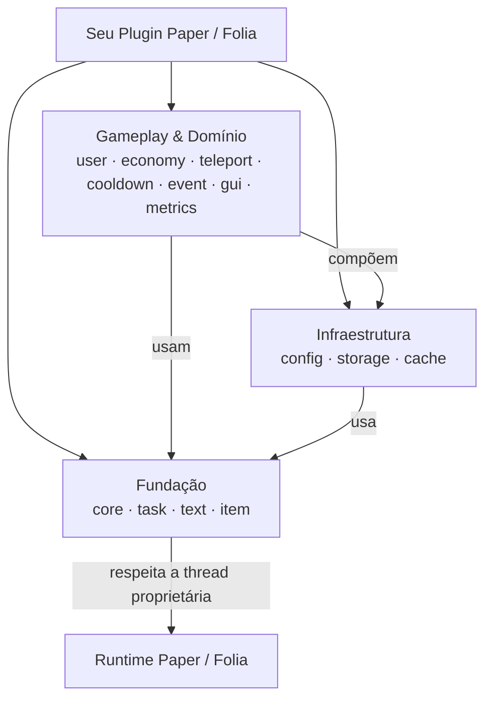

<div align="center">

# Cotani

**Infraestrutura componível e de alta performance para plugins Paper e Folia seguros e não bloqueantes.**

Construa plugins Minecraft escaláveis com limites de execução explícitos, eventos sem reflexão, interfaces reativas e persistência robusta.

[](https://github.com/HanielCota/Cotani/actions/workflows/ci.yml)
[](https://adoptium.net/)
[](https://papermc.io/)
[](https://hanielcota.github.io/Cotani/)
[](https://jitpack.io/#HanielCota/Cotani)
[](LICENSE)

[English](README.md) · [Português](README.pt-BR.md)

[Visão geral](#visão-geral) · [Compatibilidade](#compatibilidade) · [Instalação](#instalação) · [Módulos](#escolha-seus-módulos) · [Arquitetura](#arquitetura) · [Início rápido](#início-rápido-em-cinco-minutos) · [Solução de problemas](#solução-de-problemas) · [Documentação](#documentação)

---

</div>

## Visão geral

Cotani é um framework moderno Java 25 multimódulo projetado para desenvolvimento de plugins no ecossistema Paper e Folia. Ele elimina o estado global frágil e bloqueios da thread principal com transições explícitas de thread, APIs componíveis baseadas em `CompletionStage` e isolamento limpo de domínio.

| Necessidade | Abordagem do Cotani |
| :--- | :--- |
| **🧵 Thread Proprietária** | Transições global, region e entity gerenciadas via `PaperTaskScheduler` e `TaskChain` |
| **⚡ Trabalho Assíncrono** | APIs componíveis com `CompletionStage` e executors explícitos — sem bloqueios ocultos ou `join()` |
| **💾 Persistência** | Drivers SQLite, MySQL e MariaDB com migrações automáticas de schema e executor de transações |
| **🧠 Estado & Cache** | Caches baseados em Caffeine com dirty-tracking automático, flush em lote e contratos de invalidação |
| **🔄 Lifecycle do Plugin** | Propriedade centralizada, descarte em ordem inversa e encerramento não bloqueante de recursos |
| **🛡️ Qualidade de API** | Records imutáveis, null-safety rigoroso e pacotes de implementação isolados |

---

## Compatibilidade

| Versão Cotani | Versão Java | Paper API | Status do Release | Módulos Incluídos |
| :--- | :---: | :---: | :--- | :--- |
| `1.0.0` | 25 | 26.2 | Tag estável no JitPack | Core, task, text, item, config, storage, cache, user, economy, cooldown, teleport, event |
| `1.1.0-SNAPSHOT` | 25 | 26.2 | Snapshot ativo na master | Todos os módulos 1.0.0 mais BOM, GUI, Display, Command, HUD, Nametag, Dialog, Redis e Metrics |

> [!NOTE]
> `1.0.0` é a tag de release mais recente publicada. Não use a versão literal `1.1.0` até que a release seja oficialmente publicada. A documentação na `master` reflete o snapshot ativo; consulte a [tag `1.0.0`](https://github.com/HanielCota/Cotani/tree/1.0.0) para a API publicada.

---

## Instalação

### Versão Estável (`1.0.0`)

Adicione o repositório do PaperMC e do JitPack no seu script de build e declare apenas os módulos de alto nível que seu plugin utiliza:

```kotlin
repositories {
    mavenCentral()
    maven("https://repo.papermc.io/repository/maven-public/")
    maven("https://jitpack.io")
}

dependencies {
    val cotaniVersion = "1.0.0"

    implementation("com.github.HanielCota.Cotani:cotani-task:$cotaniVersion")
    implementation("com.github.HanielCota.Cotani:cotani-storage:$cotaniVersion")
}
```

O Gradle resolve automaticamente as dependências internas do Cotani de forma transitiva (por exemplo, `cotani-core` é importado automaticamente ao declarar `cotani-task`).

### Snapshot Atual & Alinhamento com BOM

Para alinhar as versões de todos os módulos Cotani usando o Bill of Materials (BOM), publique o snapshot localmente:

```bash
./gradlew publishToMavenLocal
```

Depois consuma o BOM alinhado no seu plugin:

```kotlin
repositories {
    mavenLocal()
    mavenCentral()
    maven("https://repo.papermc.io/repository/maven-public/")
}

dependencies {
    implementation(platform("com.cotani:cotani-bom:1.1.0-SNAPSHOT"))
    implementation("com.cotani:cotani-task")
    implementation("com.cotani:cotani-storage")
    implementation("com.cotani:cotani-gui")
}
```

> [!IMPORTANT]
> Os módulos Cotani são bibliotecas, não plugins de servidor independentes. Faça o shadow e relocation de `com.cotani` (e `net.cotani` caso use métricas) para o namespace privado do seu plugin usando o Gradle Shadow.

---

## Escolha seus Módulos

Declare apenas os módulos necessários para o seu conjunto de funcionalidades; as dependências transitivas são incluídas automaticamente.

### 🧱 Fundação & Execução

| Módulo | Capacidade | Disponibilidade |
| :--- | :--- | :---: |
| [`cotani-core`](cotani-core/README.md) | Lifecycle centralizado do plugin e descarte seguro de recursos | `1.0.0` |
| [`cotani-task`](cotani-task/README.md) | Agendamento async, global, region e entity com o fluente `TaskChain` | `1.0.0` |
| [`cotani-text`](cotani-text/README.md) | Parsing de MiniMessage, envio para audiências e resolução de placeholders | `1.0.0` |
| [`cotani-item`](cotani-item/README.md) | Builders fluentes de itens, armaduras e cabeças com data components do Paper 1.21+ | `1.0.0` |

### ⚙️ Infraestrutura & Persistência

| Módulo | Capacidade | Disponibilidade |
| :--- | :--- | :---: |
| [`cotani-config`](cotani-config/README.md) | Mapeamento de YAML para records imutáveis com validação de restrições e reload async | `1.0.0` |
| [`cotani-storage`](cotani-storage/README.md) | Consultas SQLite, MySQL e MariaDB, migrações de schema e transações | `1.0.0` |
| [`cotani-cache`](cotani-cache/README.md) | Caches baseados em Caffeine com dirty-tracking automático e persistência | `1.0.0` |
| [`cotani-redis`](cotani-redis/README.md) | Cliente Redis não-bloqueante, mensageria pub/sub, locks distribuídos e sync | `1.1.0-SNAPSHOT` |

### 🎮 Sistemas de Gameplay & Domínio

| Módulo | Capacidade | Disponibilidade |
| :--- | :--- | :---: |
| [`cotani-user`](cotani-user/README.md) | Carregamento assíncrono de perfis, cache online e gerenciamento de sessões | `1.0.0` |
| [`cotani-economy`](cotani-economy/README.md) | Economia exata com `BigDecimal`, transações atômicas e garantias de idempotência | `1.0.0` |
| [`cotani-cooldown`](cotani-cooldown/README.md) | Limites de cooldown locais e distribuídos em SQL com limpeza automática | `1.0.0` |
| [`cotani-teleport`](cotani-teleport/README.md) | Pipelines de teleporte orientados a políticas com checagem de perigos, tags de combate e delays | `1.0.0` |
| [`cotani-event`](cotani-event/README.md) | Event Bus de alta performance e livre de reflexão com despacho por prioridades | `1.0.0` |
| [`cotani-gui`](cotani-gui/README.md) | Interfaces declarativas de inventário com estado reativo, paginação e proteção contra exploits | `1.1.0-SNAPSHOT` |
| [`cotani-display`](cotani-display/README.md) | Motor moderno de Display Entities para hologramas de texto, itens e blocos | `1.1.0-SNAPSHOT` |
| [`cotani-command`](cotani-command/README.md) | Framework declarativo de comandos com argumentos assíncronos, cooldowns e segurança para Folia | `1.1.0-SNAPSHOT` |
| [`cotani-hud`](cotani-hud/README.md) | Scoreboards reativas zero-flicker, tablist dinâmico, bossbars e actionbars | `1.1.0-SNAPSHOT` |
| [`cotani-nametag`](cotani-nametag/README.md) | Formatação de nametags via Scoreboard Teams, prioridade de ordenação no tablist e regras de colisão | `1.1.0-SNAPSHOT` |
| [`cotani-dialog`](cotani-dialog/README.md) | Diálogos reativos não-bloqueantes de chat, placa e bigorna com wizards | `1.1.0-SNAPSHOT` |

### 📊 Operações & Ferramentas

| Módulo | Capacidade | Disponibilidade |
| :--- | :--- | :---: |
| [`cotani-metrics`](cotani-metrics/README.md) | Coletor de métricas Micrometer com exportação opcional via HTTP Prometheus | `1.1.0-SNAPSHOT` |
| [`cotani-bom`](cotani-bom/README.md) | Bill of Materials para alinhamento de versões de todos os módulos | `1.1.0-SNAPSHOT` |

---

## Arquitetura

O Cotani é organizado em camadas arquiteturais limpas. Módulos de funcionalidades compõem componentes de infraestrutura e fundação em vez de depender de singletons globais mutáveis.



Consulte a [referência completa de arquitetura](docs/architecture.md) para visualizar o grafo completo de dependências e os diagramas de sequência de fronteiras de thread.

---

## Início Rápido em Cinco Minutos

Este guia configura um plugin Paper com shadow que lê dados do jogador de forma assíncrona e retorna de maneira segura para a entity thread do jogador antes de alterar o estado do jogo.

### 1. Configure o Gradle

`build.gradle.kts`:

```kotlin
plugins {
    java
    id("com.gradleup.shadow") version "9.6.1"
}

group = "com.example"
version = "0.1.0"

java {
    toolchain.languageVersion.set(JavaLanguageVersion.of(25))
}

repositories {
    mavenCentral()
    maven("https://repo.papermc.io/repository/maven-public/")
    maven("https://jitpack.io")
}

dependencies {
    compileOnly("io.papermc.paper:paper-api:26.2.build.85-stable")
    implementation("com.github.HanielCota.Cotani:cotani-task:e2f91df")
}

tasks.shadowJar {
    archiveClassifier.set("")
    mergeServiceFiles()
    relocate("com.cotani", "com.example.cotaniquickstart.libs.cotani")
}

tasks.build {
    dependsOn(tasks.shadowJar)
}
```

### 2. Descreva o Plugin

`src/main/resources/plugin.yml`:

```yaml
name: CotaniQuickStart
version: '0.1.0'
main: com.example.cotaniquickstart.CotaniQuickStartPlugin
description: Exemplo mínimo do Cotani
api-version: '26.2'
commands:
  cotanihello:
    description: Confirma que o Cotani está funcionando
    usage: /cotanihello
```

### 3. Adicione a Classe Principal do Plugin

Utilize o [`CotaniQuickStartPlugin` verificado por compilação](docs-examples/src/main/java/com/example/cotaniquickstart/CotaniQuickStartPlugin.java). Ele demonstra controle fino de lifecycle, injeção por construtor e transições seguras para tarefas de entidade:

```java
public final class CotaniQuickStartPlugin extends JavaPlugin {

    private Cotani cotani;
    private PaperTaskScheduler scheduler;

    @Override
    public void onEnable() {
        this.scheduler = SchedulerFactory.create(this);
        this.cotani = Cotani.forPlugin(this)
            .withAsync(scheduler::closeAsync)
            .build();
    }

    @Override
    public void onDisable() {
        if (cotani != null) {
            cotani.closeAsync().exceptionally(error -> {
                getLogger().log(Level.SEVERE, "Erro ao encerrar Cotani", error);
                return null;
            });
        }
    }
}
```

### 4. Transição Async para a Entity Thread

Quando uma consulta ou serviço assíncrono for concluído, retenha o `UUID` do jogador e transite de volta para a thread da entidade utilizando `TaskChain`:

```java
UUID playerId = player.getUniqueId();
CompletionStage<String> messageStage = messageService.loadAsync(playerId);

scheduler.chain(messageStage)
    .consumeEntity(playerId, message -> {
        // Seguro para interagir com objetos Bukkit/Paper na thread do jogador
        var onlinePlayer = Bukkit.getPlayer(playerId);
        if (onlinePlayer != null) {
            onlinePlayer.sendMessage(Component.text(message));
        }
    })
    .toCompletionStage()
    .whenComplete((_, failure) -> {
        if (failure != null) {
            logger.log(Level.SEVERE, "Não foi possível enviar mensagem ao jogador " + playerId, failure);
        }
    });
```

> [!WARNING]
> Nunca chame `join()`, `get()` ou `Thread.sleep(...)` em código de servidor. Nunca carregue objetos vivos como `Player`, `World`, `Entity`, `Inventory` ou `Block` através de fronteiras assíncronas.

---

## Solução de Problemas

| Sintoma | Causa Provável | Solução |
| :--- | :--- | :--- |
| JitPack não resolve `1.1.0` | A versão de tag ainda não foi publicada | Use a estável `1.0.0`, build por hash de commit ou publique localmente com `publishToMavenLocal` |
| `NoClassDefFoundError: com/cotani/...` | JAR sem shadow instalado no servidor | Compile e instale a saída do `shadowJar` com relocation configurado |
| Exceção de async-catcher ou thread incorreta | API Bukkit acessada dentro de lambda assíncrono | Capture `UUID`s e retorne via `scheduler.chain(...).consumeEntity(...)` |
| Servidor congela durante comandos | Chamada bloqueante (`join()`, `get()`, I/O) na main thread | Componha com `CompletionStage`; elimine chamadas síncronas de banco de dados ou arquivos |
| GUI abre, mas os cliques são ignorados | `CotaniGuiModule` não foi registrado | Registre `CotaniGuiModule.create(plugin)` dentro de `Cotani.forPlugin(plugin)` |
| Testes de integração de banco não iniciam | Docker não está disponível | Inicie o daemon do Docker e valide com `docker info` antes de executar `./gradlew integrationTest` |

---

## Documentação & Recursos

- 📖 **[Cookbook do Cotani](docs/ai/cotani-cookbook.md)** — Receitas práticas para padrões comuns em plugins Paper
- 🌐 **[Documentação da API (Javadoc)](https://hanielcota.github.io/Cotani/)** — Referência agregada de Javadocs de todos os módulos
- 💡 **[Exemplos de Plugin Showcase](docs-examples/src/main/java/com/cotani/examples/showcase/ShowcasePlugin.java)** — Implementação de referência completa e verificada por compilação
- 🏗️ **[Referência de Arquitetura](docs/architecture.md)** — Grafos de dependências do Gradle e limites de execução
- 📜 **[Contratos de APIs Assíncronas](docs/async-contracts.md)** — Garantias de execução não bloqueante e tratamento de erros
- 🔄 **[Notas de Migração 1.x](docs/migration-1.x.md)** — Guia de atualização com compatibilidade de código-fonte

---

## Desenvolvimento

Clone o repositório e execute todas as validações utilizando o wrapper do Gradle incluído:

```bash
git clone https://github.com/HanielCota/Cotani.git
cd Cotani
./gradlew spotlessApply
./gradlew check
```

O comando `check` executa testes unitários, validação de formatação de código com Palantir, Error Prone, NullAway, exemplos de documentação verificados e regras de fronteiras arquiteturais. As suítes de banco com Docker são executadas separadamente:

```bash
./gradlew integrationTest
```

Consulte o [Guia de Contribuição](CONTRIBUTING.md), a [Política de Segurança](SECURITY.md) e as [Regras de Engenharia](AGENTS.md) antes de enviar contribuições.

