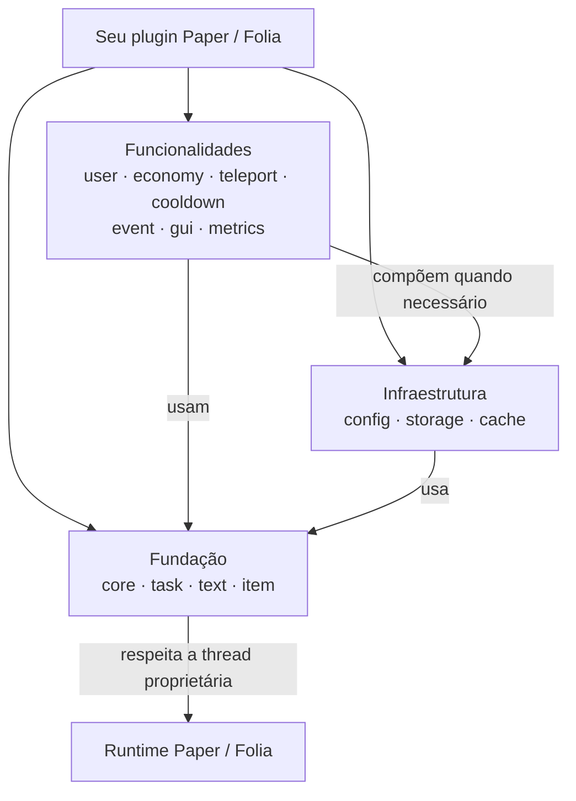

<div align="center">

# Cotani

**Infraestrutura modular para plugins Paper e Folia seguros e não bloqueantes.**

Use apenas os módulos de tarefas, armazenamento, cache, configuração e gameplay que seu plugin realmente precisa.

[](https://github.com/HanielCota/Cotani/actions/workflows/ci.yml)
[](https://adoptium.net/)
[](https://papermc.io/)
[](https://jitpack.io/#HanielCota/Cotani)
[](LICENSE)

[English](README.md) · [Português](README.pt-BR.md)

[Visão geral](#visão-geral) · [Compatibilidade](#compatibilidade) · [Instalação](#instalação) · [Escolha de módulos](#escolha-seus-módulos) · [Arquitetura](#arquitetura) · [Início rápido](#início-rápido-em-cinco-minutos) · [Solução de problemas](#solução-de-problemas)

</div>

## Visão geral

Cotani é uma biblioteca Java 25 multimódulo para criar plugins Paper e Folia com limites de execução explícitos. Ela fornece APIs focadas em agendamento, persistência, cache, configuração e sistemas comuns de gameplay sem transformar a classe principal do plugin em um service locator.

| Necessidade | Abordagem do Cotani |
| --- | --- |
| Thread proprietária | Transições global, region e entity com `PaperTaskScheduler` e `TaskChain` |
| Trabalho assíncrono | APIs componíveis com `CompletionStage` e executors explícitos, sem bloqueio escondido |
| Persistência | SQLite, MySQL e MariaDB com migrations e transações |
| Estado | Caches baseados em Caffeine com contratos de carregamento, persistência e invalidação |
| Lifecycle | Propriedade centralizada e encerramento não bloqueante dos recursos registrados |
| Qualidade de API | Valores imutáveis, contratos null-safe e pacotes de implementação isolados |

## Compatibilidade

| Cotani | Java | API Paper | Disponibilidade | Módulos |
| --- | --- | --- | --- | --- |
| `1.0.0` | 25 | 26.2 | Tag estável no JitPack | Core, task, text, item, config, storage, cache, user, economy, cooldown, teleport e event |
| `1.0.1-SNAPSHOT` | 25 | 26.2 | Apenas código-fonte ou build por commit | Todos os módulos estáveis, além de BOM, GUI e metrics |

> [!NOTE]
> `1.0.0` é a versão mais recente com tag. Não use a versão literal `1.0.1` antes de essa tag ser publicada. A documentação de `master` descreve o snapshot atual; consulte a [tag `1.0.0`](https://github.com/HanielCota/Cotani/tree/1.0.0) para a API estável exata.

## Instalação

### Versão estável

Adicione os repositórios do Paper e do JitPack e declare somente os módulos de alto nível utilizados:

```kotlin
repositories {
    mavenCentral()
    maven("https://repo.papermc.io/repository/maven-public/")
    maven("https://jitpack.io")
}

dependencies {
    val cotaniVersion = "1.0.0"

    implementation("com.github.HanielCota.Cotani:cotani-task:$cotaniVersion")
    implementation("com.github.HanielCota.Cotani:cotani-storage:$cotaniVersion")
}
```

O Gradle resolve transitivamente as dependências internas de cada módulo. Não é necessário declarar `cotani-core` quando um módulo selecionado já depende dele.

### Snapshot atual e BOM

O BOM existe no código-fonte atual, mas ainda não foi lançado. Para testá-lo sem referenciar uma versão inexistente, publique o checkout localmente:

```bash
./gradlew publishToMavenLocal
```

Depois consuma o snapshot local:

```kotlin
repositories {
    mavenLocal()
    mavenCentral()
    maven("https://repo.papermc.io/repository/maven-public/")
}

dependencies {
    implementation(platform("com.cotani:cotani-bom:1.0.1-SNAPSHOT"))
    implementation("com.cotani:cotani-task")
    implementation("com.cotani:cotani-storage")
}
```

> [!IMPORTANT]
> Os módulos Cotani são bibliotecas, não plugins de servidor independentes. Inclua-os e faça relocation dentro do seu plugin, exceto quando seu ambiente os fornecer deliberadamente de outra forma.

## Escolha seus módulos

Declare o módulo que corresponde à capacidade desejada; as dependências internas do Cotani serão incluídas transitivamente.

| Eu preciso… | Declare | Disponibilidade |
| --- | --- | --- |
| Gerenciar somente o lifecycle de recursos | `cotani-core` | `1.0.0` |
| Agendar trabalho async, global, region ou entity | `cotani-task` | `1.0.0` |
| Formatar textos Adventure e MiniMessage | `cotani-text` | `1.0.0` |
| Construir itens Paper com API fluente | `cotani-item` | `1.0.0` |
| Vincular e recarregar YAML como records imutáveis | `cotani-config` | `1.0.0` |
| Usar SQLite, MySQL ou MariaDB com migrations | `cotani-storage` | `1.0.0` |
| Manter cache genérico ou associado a jogadores | `cotani-cache` | `1.0.0` |
| Resolver usuários e gerenciar sessões | `cotani-user` | `1.0.0` |
| Executar operações econômicas idempotentes | `cotani-economy` | `1.0.0` |
| Adquirir cooldowns locais ou distribuídos | `cotani-cooldown` | `1.0.0` |
| Executar pipelines protegidos de teleporte | `cotani-teleport` | `1.0.0` |
| Despachar eventos de domínio sem reflexão | `cotani-event` | `1.0.0` |
| Criar interfaces de inventário reativas | `cotani-gui` | `1.0.1-SNAPSHOT` |
| Exportar métricas Micrometer e Prometheus | `cotani-metrics` | `1.0.1-SNAPSHOT` |
| Alinhar as versões de todos os módulos | `cotani-bom` | `1.0.1-SNAPSHOT` |

Cada módulo estável possui seu próprio guia na [referência de módulos](#referência-de-módulos).

## Arquitetura

Cotani é organizado em camadas. Módulos de funcionalidades compõem infraestrutura e fundação em vez de depender de estado global.



A [referência completa de arquitetura](docs/architecture.md) contém o grafo real de dependências Gradle e a sequência de runtime entre I/O assíncrono e a thread global, de região ou de entidade.

## Início rápido em cinco minutos

Este exemplo cria um plugin sombreado com o comando `/cotanihello`. O comando captura o UUID do jogador, delega para um serviço e retorna pelo entity scheduler do Cotani antes de acessar o Paper.

### 1. Configure o Gradle

`settings.gradle.kts`:

```kotlin
rootProject.name = "cotani-quick-start"
```

`build.gradle.kts`:

```kotlin
plugins {
    java
    id("com.gradleup.shadow") version "9.6.1"
}

group = "com.example"
version = "0.1.0"

java {
    toolchain.languageVersion.set(JavaLanguageVersion.of(25))
}

repositories {
    mavenCentral()
    maven("https://repo.papermc.io/repository/maven-public/")
    maven("https://jitpack.io")
}

dependencies {
    compileOnly("io.papermc.paper:paper-api:26.2.build.85-stable")
    implementation("com.github.HanielCota.Cotani:cotani-task:e2f91df")
}

tasks.shadowJar {
    archiveClassifier.set("")
    mergeServiceFiles()
    relocate("com.cotani", "com.example.cotaniquickstart.libs.cotani")
}

tasks.build {
    dependsOn(tasks.shadowJar)
}
```

Este início rápido fixa um commit atual porque o lifecycle não bloqueante com `closeAsync()` mostrado abaixo foi adicionado depois de `1.0.0`. Substitua o commit por `1.0.1` quando essa versão receber uma tag.

Se você adicionar `cotani-metrics`, também faça relocation de `net.cotani` para o namespace privado do plugin.

### 2. Descreva o plugin

Crie `src/main/resources/plugin.yml`:

```yaml
name: CotaniQuickStart
version: '0.1.0'
main: com.example.cotaniquickstart.CotaniQuickStartPlugin
description: Exemplo mínimo do Cotani
api-version: '26.2'
commands:
  cotanihello:
    description: Confirma que o Cotani está funcionando
    usage: /cotanihello
```

### 3. Adicione a classe do plugin

Copie o [`CotaniQuickStartPlugin` verificado por compilação](docs-examples/src/main/java/com/example/cotaniquickstart/CotaniQuickStartPlugin.java). Ele demonstra uma classe de lifecycle fina, injeção por construtor, um comando fino e uma tarefa entity nomeada sem armazenar um `Player` vivo em estado assíncrono.

### 4. Compile e execute

```bash
./gradlew shadowJar
```

Copie o JAR de `build/libs` para o diretório `plugins` do servidor, inicie o Paper e execute `/cotanihello` como jogador.

### Padrão async para entity thread

Quando o resultado assíncrono de um serviço precisar interagir com um jogador, mantenha o UUID e retorne por `TaskChain`:

```java
UUID playerId = player.getUniqueId();
CompletionStage<String> messageStage = messageService.loadAsync(playerId);

var _ = scheduler.chain(messageStage)
    .consumeEntity(playerId, message -> {
        var onlinePlayer = Bukkit.getPlayer(playerId);
        if (onlinePlayer != null) {
            onlinePlayer.sendMessage(Component.text(message));
        }
    })
    .toCompletionStage()
    .whenComplete((_, failure) -> {
        if (failure != null) {
            logger.log(Level.SEVERE, "Could not message player " + playerId, failure);
        }
    });
```

> [!WARNING]
> Nunca use `join()`, `get()` ou `Thread.sleep(...)` no código da aplicação. Nunca capture objetos vivos como `Player`, `World`, `Entity`, `Inventory` ou `Block` em fluxos assíncronos.

## Solução de problemas

| Sintoma | Causa provável | Correção |
| --- | --- | --- |
| JitPack não resolve `1.0.1` | A versão ainda é snapshot | Use `1.0.0`, um build por commit ou publique o snapshot localmente |
| O primeiro build de um commit no JitPack expira | O JitPack está compilando o commit sob demanda | Tente uma vez após o build remoto terminar ou use `publishToMavenLocal` |
| `NoClassDefFoundError: com/cotani/...` | O JAR sem shadow foi instalado | Compile e instale a saída de `shadowJar` |
| Aparece async-catcher ou erro de thread | Bukkit/Paper foi acessado em código async | Carregue UUIDs e retorne com agendamento `global`, `region` ou `entity` |
| O servidor trava durante um comando ou evento | Uma future ou operação de I/O bloqueou a thread proprietária | Componha com `CompletionStage`; remova `join()`, `get()` e I/O síncrono |
| A GUI abre, mas os cliques são ignorados | `CotaniGuiModule` não foi registrado | Siga o [guia de bootstrap do `cotani-gui`](cotani-gui/README.md) |
| Testes de integração com banco não iniciam | Docker não está disponível | Inicie o Docker, valide `docker info` e execute `./gradlew integrationTest` novamente |

## Referência de módulos

| Módulo | Finalidade |
| --- | --- |
| [`cotani-core`](cotani-core/README.md) | Propriedade do lifecycle e encerramento coordenado de recursos |
| [`cotani-task`](cotani-task/README.md) | Agendamento async, global, region e entity com `TaskChain` |
| [`cotani-storage`](cotani-storage/README.md) | SQLite, MySQL, MariaDB, migrations e transações |
| [`cotani-cache`](cotani-cache/README.md) | Caches de dados e jogadores baseados em Caffeine com persistência |
| [`cotani-config`](cotani-config/README.md) | Binding de YAML para records imutáveis, validação e reload async |
| [`cotani-user`](cotani-user/README.md) | Resolução assíncrona de usuários e lifecycle de sessões |
| [`cotani-economy`](cotani-economy/README.md) | Operações econômicas precisas, idempotentes e auditáveis |
| [`cotani-teleport`](cotani-teleport/README.md) | Pipelines de teleporte orientados a políticas e verificações de segurança |
| [`cotani-cooldown`](cotani-cooldown/README.md) | Aquisição de cooldowns locais e distribuídos |
| [`cotani-event`](cotani-event/README.md) | Eventos e inscrições sem reflexão |
| [`cotani-gui`](cotani-gui/README.md) | Interfaces declarativas de inventário com estado reativo e proteção contra exploits |
| [`cotani-metrics`](cotani-metrics/README.md) | Métricas Micrometer e exportação Prometheus opcional |
| [`cotani-text`](cotani-text/README.md) | Utilitários de formatação Adventure e MiniMessage |
| [`cotani-item`](cotani-item/README.md) | Builders fluentes de itens com data components do Paper |

## Documentação

- [Cookbook do Cotani](docs/ai/cotani-cookbook.md) — receitas completas para plugins
- [Arquitetura completa](docs/architecture.md) — dependências reais e limites de execução
- [Contratos das APIs assíncronas](docs/async-contracts.md) — semântica de execução e falhas
- [Migração do Cotani 1.x](docs/migration-1.x.md) — orientações de compatibilidade
- [Exemplos verificados por compilação](docs-examples/src/main/java/com/cotani/examples/CotaniExamples.java) — exemplos validados pelo build

## Desenvolvimento

Clone o repositório e execute as verificações com o wrapper incluído:

```bash
git clone https://github.com/HanielCota/Cotani.git
cd Cotani
./gradlew spotlessApply
./gradlew check
```

`check` executa testes unitários, validação de formatação, Error Prone, NullAway, exemplos de documentação e regras de fronteira entre módulos. As suítes de banco com Docker são separadas:

```bash
./gradlew integrationTest
```

Leia o [fluxo de contribuição](CONTRIBUTING.md), a [política de segurança](SECURITY.md) e as [regras de engenharia](AGENTS.md) antes de enviar alterações.
