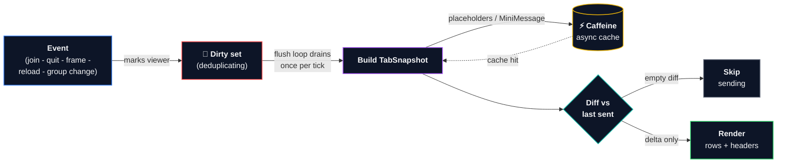

# Architecture Diagram: Why It's Fast

This diagram explains the performance scaling mechanism of the Tablist renderer. It ensures computational cost scales directly with state **changes**, rather than the player count or server tick rate.

## Mermaid Flowchart

## How It Works (The 3 Core Mechanisms)

1. **Deduplication (Dirty Set)**: State changes queue dirty entities, collapse redundant triggers occurring within the same tick, and delay calculations to a single flush cycle per tick.
2. **Asynchronous Cache (Caffeine)**: String parsing and template compilations (MiniMessage, Placeholders) run off the server's main thread and are cached inside Caffeine.
3. **Delta Rendering (Diff Checking)**: A comparison check between the compiled frame and the client's last active frame calculates the exact structural difference. If there are no updates, the packet is skipped. Otherwise, only changed rows are transmitted.
