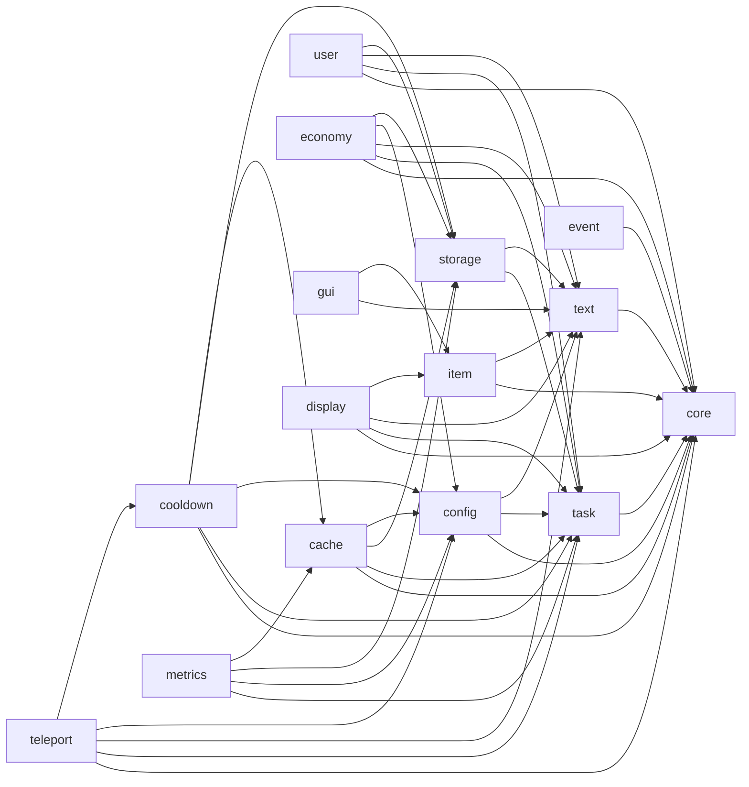
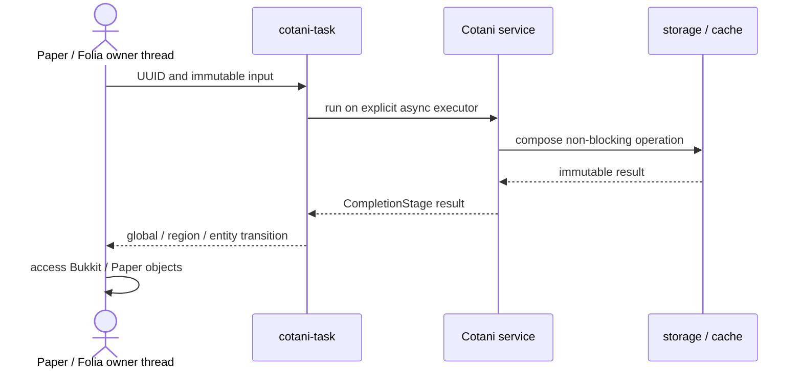

# Cotani architecture

Cotani separates lifecycle, execution, infrastructure and gameplay concerns into independently consumable modules. A plugin declares only its top-level modules; Gradle resolves their transitive Cotani dependencies.

## Module dependency graph

An arrow from `A` to `B` means that module `A` directly depends on module `B`. The BOM is not shown because it aligns versions and adds no runtime dependency.

## Responsibility layers

| Layer | Modules | Responsibility |
| --- | --- | --- |
| Lifecycle | `core` | Own and close resources without acting as a service locator |
| Execution and presentation | `task`, `text`, `item` | Thread transitions, messages and item construction |
| Infrastructure | `config`, `storage`, `cache` | Configuration, persistence and state coordination |
| Domain features | `user`, `economy`, `cooldown`, `teleport`, `event`, `gui`, `display` | Reusable plugin use cases and user-facing behavior |
| Operations | `metrics` | Runtime measurements and optional Prometheus export |

## Runtime execution boundary

Paper and Folia objects stay on the thread that owns them. Asynchronous flows carry immutable identifiers and plain data across the boundary.

Never carry live `Player`, `World`, `Entity`, `Inventory` or `Block` instances into the asynchronous portion of this flow. See [asynchronous API contracts](async-contracts.md) for the complete execution and failure semantics.
