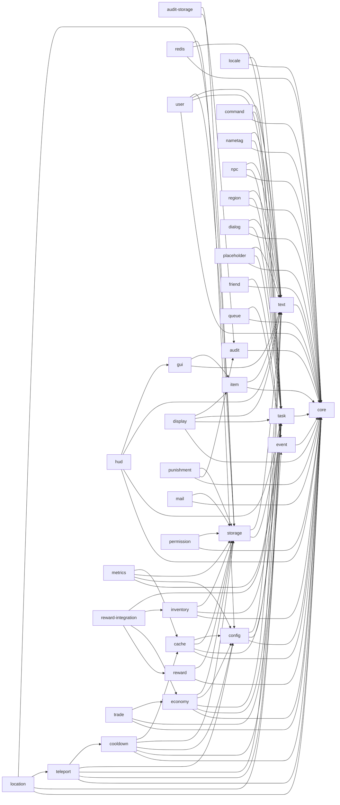
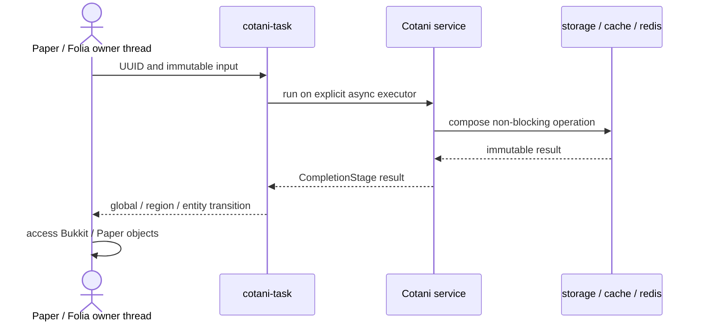

# Cotani architecture

Cotani separates lifecycle, execution, infrastructure and gameplay concerns into independently consumable modules. A plugin declares only its top-level modules; Gradle resolves their transitive Cotani dependencies.

## Module dependency graph

An arrow from `A` to `B` means that module `A` directly depends on module `B`. The BOM is not shown because it aligns versions and adds no runtime dependency.

## Responsibility layers

| Layer | Modules | Responsibility |
| --- | --- | --- |
| Lifecycle | `core` | Own and close resources without acting as a service locator |
| Execution and presentation | `task`, `text`, `item`, `locale` | Thread transitions, messages, localized catalogs and item construction |
| Infrastructure | `config`, `storage`, `cache`, `redis` | Configuration, persistence, caching, distributed synchronization, and admission-controlled external I/O |
| Domain features | `user`, `economy`, `cooldown`, `teleport`, `event`, `gui`, `display`, `command`, `hud`, `nametag`, `npc`, `region`, `dialog`, `permission`, `placeholder`, `inventory`, `friend`, `queue`, `trade`, `punishment`, `location`, `mail`, `reward` | Reusable player and gameplay use cases, permission decisions, placeholder expansion, inventory synchronization, friendships, matchmaking queues, confirmation-based trading, moderation punishments, saved homes and warps, persistent player mail, idempotent rewards, NPCs, 3D regions, HUD, nametags, and reactive interfaces |
| Integration | `reward-integration` | Standard settlement adapters that deliver reward currency and items |
| Operations | `audit`, `audit-storage`, `metrics` | Immutable audit history, SQL audit persistence, runtime measurements, and optional Prometheus export |

## Runtime execution boundary

Paper and Folia objects stay on the thread that owns them. Asynchronous flows carry immutable identifiers and plain data across the boundary.

Never carry live `Player`, `World`, `Entity`, `Inventory` or `Block` instances into the asynchronous portion of this flow. See [asynchronous API contracts](async-contracts.md) for the complete execution and failure semantics.
